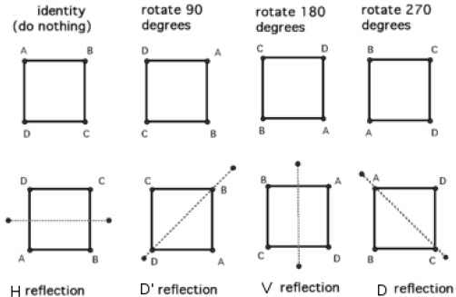
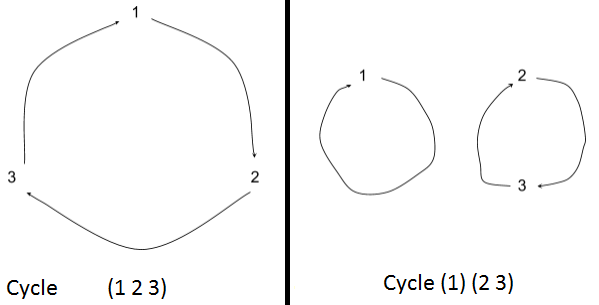
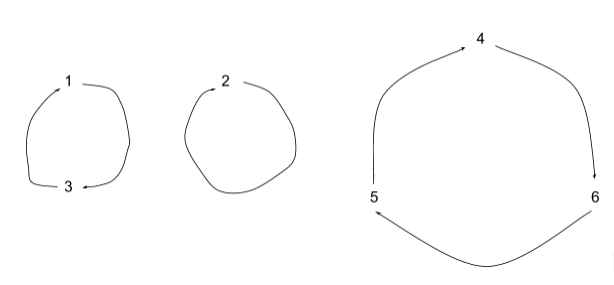

**Important**: since github markdown doesn't support LaTeX, view the complete note in the following link instead: <https://rawgit.com/oldfatcrab/PMATH336/master/PMATH336_note.html>

--------------------------------------------------------------------------------

# Table of Content

- [Chapter 0: Course Administration](#toc_1) (May 02)
- [Chapter 1: Groups](#toc_2) (May 02)
    - [1.1 Definitions and examples](#toc_3) (May 02)
    - [1.2 Subgroups](#toc_4) (May 06)
    - [1.3 Finite groups](#toc_5) (May 13)
    - [1.4 Cyclic groups](#toc_6) (May 18)
- [Chapter 2: Group homomorphisms](#toc_7) (May 30)
    - [2.1 Homomorphism and Isomorphism](#toc_8) (May 30)
    - [2.2 Permutation Groups](#toc_9) (Jun 10)
    - [2.3 Automorphisms](#toc_10) (Jun 22)
- [Chapter 3: Lagrange Theorem and Group Actions](#toc_11) (Jun 27)
    - [3.1 Langrange Theorem and Cosets](#toc_12) (Jun 27)
    - [3.2 Group Actions](#toc_13) (Jul 4)
    - [3.3 Stabilizers and orbits of an action](#toc_14) (Jul 6)

--------------------------------------------------------------------------------

_2016/05/02_

# Chapter 0: Course Administration
- Course structure
    - Group Theory Basics
        - Examples
        - Axioms
        - Subgroups and Lagrange's Theorem
        - Cyclic groups
        - Permutation groups
        - Normal subgroups
        - quotients
        - homomorphisms
        - Isomorphism theorems
        - automorphism groups and conjugation
    - Group Actions
        - The orbit-statiliser theorem
        - Cauchy's theorem
        - Burnside's lemma
        - P&ograve;lya enumeration
        - the class equation
    - Other Topics
        - Platonic solids
        - classification of finite abelian groups
        - cryptography
        - application to physics (if time permitting)
- Grading
    - 6 assignments: 30%
    - Midterm: 20%
    - Final: 50%
- Office
    - MC 5427
    - Monday 14:00-16:00, Thursday 15:00-17:00, or by appointment

--------------------------------------------------------------------------------

# Chapter 1: Groups

## 1.1 Definitions and examples:

- Let $G$ be a non-empty set.
    - Def'n: A binary operation on $G$ is a map that
        - $G \times G \implies G$
        - $(a,b) \mapsto a\star b$ or $a\cdot b$ or $ab$ (notation)
    - A binary operation is often called a **product**
- Ex 1)
    - $G=\mathbb{Z}$ and
    - and $+: \mathbb{Z}\times \mathbb{Z} \implies \mathbb{Z}$, $(m,n) \mapsto m+n$
    - or $\cdot: \mathbb{Z}\times \mathbb{Z} \implies \mathbb{Z}$, $(a,b) \mapsto ab$
- Ex 2)
    - $G=\mathbb{R}^3$
    - and $ +: \mathbb{R}^3 \times \mathbb{R}^3 \implies \mathbb{R}^3, ((x_1, y_1, z_1), (x_2, y_2, z_2)) \mapsto (x_1+x_2, y_1+y_2, z_1+z_2)$
    - and $\times: \mathbb{R}^3 \times \mathbb{R}^3 \implies \mathbb{R}^3, ((x_1, y_1, z_1), (x_2, y_2, z_2)) \mapsto (x_1, y_1, z_1) \cdot (x_2, y_2, z_2)$
    - but $\dot: \mathbb{R}^3 \times \mathbb{R}^3  \implies \mathbb{R}, ((x_1, y_1, z_1), (x_2, y_2, z_2)) \mapsto (x_1x_2, y_1y_2, z_1z_2)$ is **not** a binary operation because the target space is not $G=\mathbb{R}^3$
- Def'n (**Groups**): Let $G$ be a non-empty set with a binary operation, $G\times G\implies G$, then $G$ is a **group** if the binary operation has the following properties:
    - (i) (**Associativity**): $a(bc) = (ab)c$, $\forall a,b,c \in G$
    - (ii) (**Identity**): $\exists e \in G$ such that: $ea = ae =a, \forall a$ in $G$
    - (iii) (**Inverse**): $\forall a \in G$, $\exists a^{-1} \in G$ such that: $aa^{-1} = a^{-1} a = e$
- Ex 1)
    - The integers: $(\mathbb{Z},+) \leadsto $ this is a group
    - **HERE**: $G = \mathbb{Z}$ and $+: \mathbb{Z}\times\mathbb{Z} \implies \mathbb{Z}, (m,n) \mapsto m+n$
    - Does $+$ satisfy properties (i) to (iii)?
        - (i) Let $m, n, r \in \mathbb{Z}$, then:
            - $m+(n+r) = (m+n)+r$ ? YES!
        - (ii) Identity of $+$ is $0 \in \mathbb{Z}$
            - because $0 + m = m + 0 = m, \forall m \in \mathbb{Z}$
        - (iii) $\forall m \in \mathbb{Z}$, we have that
            - $m + (-m) = (-m) + m = 0$
            - $\implies -m \in \mathbb{Z}$ is the inverse of $m \in \mathbb{Z}$
        - Thus, $(\mathbb{Z},+)$ is a group.
- Ex 2)
    - The integers: $(\mathbb{Z},\cdot)\leadsto$ this is a group
    - **HERE**: $G = \mathbb{Z}$ and $\cdot: \mathbb{Z}\times\mathbb{Z} \implies \mathbb{Z}, (m,n) \mapsto m\cdot n$
    - Does $\cdot$ satisfy properties (i) to (iii)?
        - (i) Let $m, n, r \in \mathbb{Z}$, then:
            - $m\cdot(n\cdot r) = (m\cdot n)\cdot r$ ? YES!
        - (ii) Identity of $\cdot$ is $1 \in \mathbb{Z}$
            - because $1 \cdot m = m \cdot 1 = m$, $\forall m \in \mathbb{Z}$
        - (iii) $\forall m \in \mathbb{Z}$, the inverse of m with respect to multiplication is $\frac{1}{m}$ (if $m \neq 0$), but $\frac{1}{m} \notin \mathbb{Z}$ if $m\neq\pm1$. So property (iii) fails!
        - Thus, $(\mathbb{Z},\cdot)$ is not a group.
- Ex 3)
    - $G = \{1, -1\}$ set of 2 elements with the binary operation given by:

| $\cdot$ | $1$  | $-1$ |
|---------|----|----|
| $1$       | $1$  | $-1$ |
| $-1$      | $-1$ | $1$  |

- (continue)
    - Note that $\cdot$ is just the usual product in $\mathbb{R}$ restricted to element in $G$. Then $G$ is a group because:
        - (i) $\cdot$ is associative because multiplication in $\mathbb{R}$ is associative
        - (ii) $1$ is the identity.
        - (iii) From the table, we see that $1$ is the inverse of $1$ and $-1$ is the inverse of $-1\leadsto$ every element in $G$ has an inverse.
- Ex 4)
    - $(\mathbb{Q}, +)$ is a group (exercise)
- Ex 5)
    - $ (\mathbb{Q}^*, \cdot)$ is a group where $\mathbb{Q}^* = \mathbb{Q}\setminus\{0\}$
    - Indeed:
        - (i) Multiplication in $\mathbb{Q}^*$ is associative as in $\mathbb{Z}$ and $\mathbb{R}$
        - (ii) $1 \in \mathbb{Q}^*$ is the identity with respect to \dot.
        - (iii) $\forall \frac{a}{b} \in \mathbb{Q}^*$, we have that $\frac{b}{a} \in \mathbb{Q}^*$ and $\frac{a}{b} \cdot \frac{b}{a} = \frac{b}{a}\cdot \frac{a}{b} = 1 \implies \frac{a}{b}^{-1} = \frac{b}{a} \implies$ every element in $\mathbb{Q}^*$ has an inverse
    - Note:
        - $(\mathbb{Q}, \cdot)$ is **not** a group because even though (i) and (ii) hold, property (iii) fails for $0 \in \mathbb{Q}$
- Ex 6)
    - $(\mathbb{R}, +)$ and $(\mathbb{C}, +)$ are groups
- Ex 7)
    - $(\mathbb{R}^*, \cdot)$ and $(\mathbb{C}^*, \cdot)$ are groups (where $\mathbb{R}^* = \mathbb{R}\setminus\{0\}$ and $\mathbb{C}^* = \mathbb{C}\setminus\{0\})$
- Ex 8)
    - $(\{1, i, -1, -1\}, \cdot)$ is a group, where $i \in \mathbb{C}$ such that $i^2 = -1$. Here:

| $\cdot$ | $1$  | $i$  | $-1$ | $-i$ |
|---------|----|----|----|----|
| $1    $   |$ 1  $|$ i$  | $-1$ | $-i$ |
| $i   $    |$ i  $|$ -1$ | $-i$ | $1 $ |
| $-1 $     |$ -1 $|$ -i$ | $1 $ | $i $ |
| $-i$      |$ -i $|$ 1 $ | $i $ | $1 $ |

_2016/05/04_

- Review from last lecture:
	- Def'n (**Groups**): Let $G$ be a non-empty set with a binary operation, $G\times G\implies G$, then $G$ is a **group** if the binary operation has the following properties:
	    - (i) (**Associativity**): $a(bc) = (ab)c$, $\forall a,b,c \in G$
	    - (ii) (**Identity**): $\exists e \in G$ such that: $ea = ae =a, \forall a$ in $G$
	    - (iii) (**Inverse**): $\forall a \in G$, $\exists a^{-1} \in G$ such that: $aa^{-1} = a^{-1} a = e$
- Note: Properties (i)-(iii) in the def'n are called the **group axioms**
- Ex 9) **Integer module n**: $\mathbb{Z}_n$
	- In $\mathbb{Z}_n$, two integer $r$ and $s$ are equivalent if $r = s+an$, for same $a$ in $\mathbb{Z}$, this is written as $r \equiv s$ (mod $n$)
	- e.g.:
 		- $\mathbb{Z}_3 = \{\overline{0}, \overline{1}, \overline{2}\}$
 		- $\overline{0} \equiv \{0, 3, -3, 6, \cdots\} \equiv \overline{3}$
 		- $\overline{1} \equiv \{1, 4, -2, 7, \cdots\} \equiv \overline{4}$
 		- $\overline{2} \equiv \{2, 5, -1, 8, \cdots\} \equiv \overline{5}$
	- $\forall F, F' \in \mathbb{Z}_n$, we set:
		- $\overline{r} + \overline{r_1} = \overline{r+r_1}$, and
		- $\overline{r} \cdot \overline{r_1} = \overline{r \cdot r1}$
	- $(\mathbb{Z}_n, +)$: since $+$ is associative in $\mathbb{Z}$, it is also associative with $\mathbb{Z}_n$. Moreover, $\overline{0}$ is the identity for $+$. finally, $\overline{-r}$ is **inverse** of $F$ with respect to $+$. We will denote $\overline{-r}$ by $-\overline{r} \implies (\mathbb{Z}_n, +)$ is a group
	- $(\mathbb{Z}_n, \cdot)$: Again, since $\cdot$ is associative in $\mathbb{Z}$, it is also associative in $\mathbb{Z}$,. And $\overline{1}$ is the identity for $\cdot$, however, not every element in $\mathbb{Z}_n$ has an inverse with respect to $\cdot$. In fact, recall that $F \in \mathbb{Z}_n$ has a multiplicative inverse iff $gcd(r,n) = 1$. I.e. $\exists \overline s \in \mathbb{Z}_n$ such that $\overline r \cdot \overline s = \overline s \cdot \overline r = \overline 1$ iff $gcd(r, n) = 1$
	- If an element $\overline r \in \mathbb{Z}_n$ has an inverse in $\mathbb{Z}_n$, it is called a **unit**.
	- Set $\mathbb{Z}_n^* = \{\text{units in }\mathbb{Z}_n\} = \{F\in \mathbb{Z}_n \mid gcd(r,n)=1\}$. Then, $(\mathbb{Z}_n^*, \cdot)$ is a group
		- E.g. $\mathbb{Z}_6 = \{\overline 1, \overline 2, \overline 3, \overline 4, \overline 5, \overline 6\}$ and $\mathbb{Z}_6^* = \{\overline 1, \overline 5\}$
	- The Cayley table for $(\mathbb{Z}_6, \cdot)$ is:

| $\cdot$ | $\overline 1$  | $\overline 5$ |
|---------|----|----|
| $\overline 1$ | $\overline 1$ | $\overline 5$ |
| $\overline 5$ | $\overline 5$  | $\overline 1$ |

- Def'n: Let $(G, \cdot)$ be a group, the **order of the group** $G$ is denoted $\mid G \mid$, is the number of element in the group
	- Remark: If the binary operation is clear, we write $G$ instead of $(G, \cdot)$
	- E.g.:
		- $(\mathbb{Z}, +) \implies \mid\mathbb{Z}\mid = \infty$
		- $(\mathbb{Z}_6,+) \implies \mid\mathbb{Z}_6\mid = 6$
		- $(\mathbb{Z}_6^*,\cdot) \implies \mid\mathbb{Z}_6^* \mid = 2$
- Aside: There is another important set of objets in abstract algebra, which corresponds to rings (with identity):
	- Def'n: A **ring** (with identity) is a non-empty set $G$ together with **two** binary operations $+$, $\cdot$, such that:
		- 1) $(G,+)$ is a group (i.e. $+$ satisfies properties (i)-(iii)
		- 2) $(G,\cdot)$ is such that $\cdot$ satisfies (i) and (iii) 
		- 3) $+$ and $\cdot$ satisfy the distributive lays: $(a+b)\cdot c = a\cdot c+b\cdot c, \forall a,b,c \in G$
	- E.g. $(\mathbb{Z}, +, \cdot)$, $(\mathbb{R}, +, \cdot)$, $(\mathbb{C}, +, \cdot)$, $(\mathbb{Q}, +, \cdot)$ , $(\mathbb{Z}_6, +, \cdot)$ etc.
	- In a ring, the elements that have inverses with respect to multiplication are called **units**
- Def'n: A group $(G, \cdot)$ is called **abelian** if the binary operation is **commutative**: $a \cdot b = b \cdot a, \forall a,b \in G$
	- E.g. $(\mathbb{Z}, +)$, $(\mathbb{R}, +)$, $(\mathbb{C}, +)$, $(\mathbb{Q}, +)$ , $(\mathbb{Z}_6, +)$ etc.
	- However, not every group is abelian!
		- E.g. Consider $G = GL(n, \mathbb{R}) = \{A\in M_{n\times n}(\mathbb{R}) \mid A\text{ is invertible}\} = \{A\in M_{n\times n}(\mathbb{R}) | \det A \neq 0\} $
	- Note that $\exists$ natural operations on $n\times n$ matrices: addition and multiplication. Let $A, B \in M_{n\times n}(\mathbb{R})$. Then:
		- $A+B,\, A\cdot B \in M_{n\times n}(\mathbb{R})$
		- $\implies +$, $\cdot$ are binary operations for $M_{n\times n}(\mathbb{R})$
		- However, if $A, B \in G$, although $A\cdot B \in G$, may not have $A+B \in G$ (e.g. $a\in G$ so that $0\in G$, but $A+(-A)=0 \notin G$) $\implies$ $+$ is not a binary operation with for $G$
		- Consider $(G, \cdot)$. Then it is a group (exercise) where the identity is the nxn identity matrix $I_{n\times n}$. But, $(G, \cdot)$ is **not** abelian because $AB \neq BA$ for most $A,B \in G$
	- A group $(G, \cdot)$ is called **non-abelian** if it is not abelian.
- **Some basic properties**:
	- 1) The identity element $e$ in a group $(G, \cdot)$ is unique
	- 2) The inverse of an element in a group $(G, \cdot)$ is unique

_2016/05/06_

- Review:
	- Def'n (**Groups**): Let $G$ be a non-empty set with a binary operation, $G\times G\implies G$, then $G$ is a **group** if the binary operation has the following properties:
	    - (i) (**Associativity**): $a(bc) = (ab)c$, $\forall a,b,c \in G$
	    - (ii) (**Identity**): $\exists e \in G$ such that: $ea = ae =a, \forall a$ in $G$
	    - (iii) (**Inverse**): $\forall a \in G$, $\exists a^{-1} \in G$ such that: $aa^{-1} = a^{-1} a = e$
	- **Some basic properties**:
		- 1) (**Uniqueness of identity**) The identity element $e$ in a group $(G, \cdot)$ is unique
		- 2) (**Uniqueness of inverses**) The inverse of an element in a group $(G, \cdot)$ is unique
- Proof of above identities:
	- 1) (Uniqueness of identity)
		- Suppose $\exists e, f \in G$ such that $ae = ea = a$ and $af = fa = a, \forall a \in G$.
		- In particular, since  $f\in G$, we have that $f = fe$ because $e$ is an identity
		- Similarly, because $e\in G$ and $f$ is an identity, $fe = e$
		- $\implies f=fe=e$
	- 2) (Uniqueness of inverses)
		- Let $a\in G$. Suppose that a has **two** inverses in $G$, say $a^{-1}$ and $b$. Therefore, by property (iii), we have: $aa^{-1} = a^{-1} a = e$ and $ab = ba = e$
		- Then $a^{-1} = a^{-1}e = a^{-1}(ab) = (a^{-1}a)b = eb = b$
		- $\implies a^{-1}=b$
- Using these properties, we obtain:
	- 3) $e{-1}=e$
	- 4) $(ab)^{-1}=b^{-1}a^{-1},\forall a,b \in G$
	- 5) $(a^{-1})^{-1}=a,\forall a \in G$
	- 6) $(a_1a_2\cdots a_n)^{-1} = a_n^{-1}\cdots a_2^{-1}a_1^{-1}$
	- 7) (Cancellation Property) Let $a,b,c\in G$ with $G$ a group. If ab = ac, then b=c. If ba=ca, then b = c.
- Proof:
	- 3) 
		- By uniqueness of the inverse, it is enough to check that $ee = ee = e$ to proof that $e^{-1}=e$. But this is true by property (ii).
	- 4)
		- By uniqueness of the inverse, it is enough to check that $ab(b^{-1}a^{-1}) = (b^{-1}a^{-1})ab = e$
		- By associatitivy, we have that $ab(b^{-1}a^{-1} = a(bb^{-1})a^{-1} = aea^{-1} = (ae)a^{-1} = aa^{-1} = e$
		- Similarly, $(b^{-1}a^{-1})ab=b^{-1}(a^{-1}a)b=b^{-1}eb=(b^{-1}e)b=b^{-1}b=e$
		- $\implies (ab)^{-1}=b^{-1}a^{-1}$
		- Note: 
			- $GL(n,\mathbb{R})=$ all general linear group 
			- One would be tempted to think that $(ab)^{-1}=a^{-1}b^{-1}$ but this is false in general.
			- Example:
				- $(G,\cdot) = (GL(2,\mathbb{R}),\cdot)$
				- A = $\begin{pmatrix}1&2\\0&1\end{pmatrix}$ and B = $\begin{pmatrix}2&0\\0&3\end{pmatrix}$
				- $\implies AB = \begin{pmatrix}2&6\\0&3\end{pmatrix}$ and $(AB)^{-1}=\begin{pmatrix}\frac{1}{2}&-1\\ 0&\frac{1}{3} \end{pmatrix}$
				- But, $A^{-1}B^{-1} = \begin{pmatrix}\frac 1 2&-\frac 2 3\\0&\frac 1 3\end{pmatrix} \neq (AB)^{-1}$
				- Nonetheless, $B^{-1}A^{-1} = \begin{pmatrix}\frac{1}{2}&-1\\ 0&\frac{1}{3} \end{pmatrix} = (AB)^{-1}$
			- In fact, one can show that: $(ab)^{-1}=a^{-1}b^{-1},\forall a,b,\in G \Leftrightarrow G$ is abelian (Exercise).
	- 5) and 6)
		- Exercise in assignment 1
	- 7) 
		- Suppose that $ab = ac$. Then, since $G$ is a group, $\exists a^{-1}\in G$ such that $aa^{-1}=a^{-1}a=e$
		- Therefore $a^{-1}(ab)=(a^{-1}a)b=eb=b$
		- Similarly, $a^{-1}(ac)=c$.
		- But, $ab=ac$, so that $a^{-1}(ab)=a^{-1}(ac)=c$
		- The proof of 2nd cancellation property is similar

## 1.2 Subgroups

- Def'n: Let $G$ e a group. If a subset $H$ of $G$ is itself a group under the operation of $G$, we say that H is a **subgroup** of $G$.
- Note: the definition of a subgroup implies that subset it **is closed under the operation in G**. I.e. $\forall a,b\in H$, then $ab\in H$. This ensures that restriction of the binary operation $G\times G\implies G$ is again a binary operation taking $H\times H\implies H$. However, a subset of a group of $G$ may not be closed under the operation on $G$.
	- E.g. $(M_{n\times n}(\mathbb{R}), +)$ is a group and $GL(n,\mathbb R)=\{A\in M_{n\times n}(\mathbb R) \mid \det A\ne 0\} \subset M_{nxn}(\mathbb R)$, but $GL(n, \mathbb R)$ is not closed under $+$ (e.g. $\forall A \in GL(n,\mathbb R), -A \in GL(n,\mathbb R)$) but $A+(-A) \notin GL(n,\mathbb R)$
- We use the notation $H \vartriangleleft G$ (or $H<G$) to mean that H is a subgroup of $G$. (some authors use $H\trianglelefteq G$ and $H\vartriangleleft G$ indicates that $H \leq G$). If $H \leq G$, then H is called a **proper subgroup of G**. The singleton $\{e\}$ is a subgroup of $G$ called the **trivial subgroup**; a subgroup of $G$ that is not $\{e\}$ is called a **non-trivial subtroup of G**.
- How does one determine whether or not a subset $H$ of $G$ is a subgroup? There are 2 tests:
	- Theorem (**One-step subgroup test**): Let $H$ be a non-empty subset of a group $G$. If $ab^{-1}\in H,\forall a,b\in H$, then $H\vartriangleleft G$.

_2016/05/09_

- Review from previous lectures:
	- $(G,\cdot)$ is a group if:
		- operation is associative
		- (**Identity**): $\exists e\in G$ such that $ae = ea = a, \forall a\in G$
		- (**Inverses**): $\forall a \in G, \exists a^{-1} \in G$ such that $aa^{-1}=a^{-1}a=e$.
	- Subgroup: let $0\neq H\subset G$ such that $H$ itself is a group under the same operation as G
	- Note: It is implicit in the definition that $H$ is closed under the operation of $G$ (i.e., $\forall a,b \in H$, then $ab\in H$).
	- Theorem (**One-step subgroup test**): Let $G$ be a group and $H$ be a non-empty subset of $G$. Then, $H$ is a subgroup of $G$ if $[ab^{-1}\in H,\forall a,b\in H]\quad(*)$

- Proof of one-step subgroup test:
	- We first need to check that H is closed under the operation in G. Given then property that $ab^{-1} \in H, \forall a,b\in H $ if we can prove that, $\forall a,b \in H, b^{-1}\in H$, then $ab=a(b^{-1})_{-1}\in H$.
	- We first notice that $e\in H$, because $H$ has at least one element, say a, so that $e=aa^{-1}\in H$ (by $(*)$).
	- Also, $e^{-1} = e$. Thus, $\forall a \in H$, we have that $a^{-1} = ea^{-1}\in H$ (by $(*)$).
	- Finally, $\forall a,b\in H$, since $b^{-1}\in H$, we get that $ab=a(b^{-1})^{-1}\in H$ by $(*)$
	- $\implies H$ is closed under the operation
	- Note: we still to check that the restriction of the operation on $G$ satisfies the 3 group axioms. Since the operation is associative on $G$, it is also associative on $H$. And we have already seen that the identity and inverse axioms hold.

- Theorem (**Two-step subgroup test**) Let $G$ be a group and $H$ be a non-empty subset of $G$. Then $H$ is a subgroup of $G$ if $ab\in H \forall a,b\in H$ (H is closed under the operation on G), and $a^{-1} \in H, \forall a \in H$ (H is closed under inverse).
	- Proof: Let $a,b\in H$. Then $b^{-1} \in H$ so that $ab^{-1} \in H$. Thus, by one-step subgroup test, H is a subgroup.
		- Remark: The two-step subgroup test is useful if one already knows that **the subset $H$ of $G$ is clsed under the operation or clsed under inverses**, so that there then is only one thing left to check.
	- Ex 1)
		- $(\mathbb C, +) \leadsto (\mathbb Z^*, +) \vartriangleleft (\mathbb Q^*,+)\vartriangleleft (\mathbb R^*,+)\vartriangleleft (\mathbb C^*,+)$
		- $(\mathbb C, \cdot) \leadsto (\mathbb Q^*,\cdot)\vartriangleleft (\mathbb R^*,\cdot)\vartriangleleft (\mathbb C^*,\cdot)$
		- Note: $^*$ means without zero
	- Ex 2)
		- $(\{1,-1\}, \cdot)$ group with $\cdot$ the usual multiplication in $\mathbb C$
		- $(\{1,-1\}, \cdot)\vartriangleleft(\mathbb Q^*, \cdot)\vartriangleleft(\mathbb R^*, \cdot)\vartriangleleft(\mathbb C^*, \cdot)$
	- Ex 3)
		- $(\mathbb Z, +)$
		- $H=\{2m\mid m\in \mathbb Z\} \implies $ H is closed under $+$ since the sum of 2 even integers is even
		- Also, $\forall 2m \in H$, its inverse - $2m\in H \implies H$ is closed under inverse. Thus, $H \vartriangleleft (\mathbb Z,+)$ by the two-step subgroup test
	- Ex 4)
		- $(\mathbb Z_6,+) =\{\overline 0, \overline 1, \overline 2, \overline 3, \overline 4, \overline 5\}$
		- Then, $H = \{\overline 0, \overline 2, \overline 4\} \vartriangleleft \mathbb Z_6$
		- $(Z_6^*, \cdot) = {\overline 1, \overline 5} \leadsto $ the only proper subgroup of $Z_6^*$ is the trivial subgroup $H=\{\overline 1\}$
		- $(Z_{12}^*, \cdot) =\{\overline 1,\overline 5,\overline 7,\overline{11}\}$
	
	| $\cdot$ | $\overline 1$  | $\overline 5$ | $\overline 7$ | $\overline {11}$ |
	|---------|----|----|---|----|
	| $\overline 1$ | $\overline 1$ | $\overline 5$ | $\overline 7$ | $\overline{11} $ |
	| $\overline 5$ | $\overline 5$  | $\overline 1$ | $\overline{11}$ | $\overline 7$ |
	| $\overline 7$ | $\overline 7$  | $\overline{11}$ | $\overline 1$ | $\overline 5$ |
	| $\overline{11}$ | $\overline{11}$  | $\overline 7$ | $\overline 5$ | $\overline 1$ |

-	
	- 
		- Every element is inverse itself
		- $(\{\overline 1, \overline5\},\cdot), (\{\overline 1,\overline 7 \},\cdot), (\{\overline 1, \overline{11} \},\cdot), (\{\overline1 \},\cdot)\leftarrow$ These are the only proper subgroups of $(\mathbb Z_{12}^*, \cdot)$
	- Note: We have seen in the proof of the one-step subgroup test that if $H\vartriangleleft G$, then $e \in H$ where $e$ is the identity in $G$. However, since $H$ is closed under the operation on $G, \forall a\in H, ae = ea = a$ (since $e$ is the identity in $G$) $\implies e$ is an identity element in $H$ for the operation in $H$. So, because identity element are unique, $e$ is also the identity in $H$.
- Prop: Let $G$ be a group and $a\in G$. Set $\langle a\rangle:=\{a^m = aa\cdots a \mid m\in \mathbb Z\}$ Then $\langle a\rangle \vartriangleleft G$ called the **cyclic subgroup of $G$ generated by $a$**
	- Proof:
		- Let $a^m, a^{m'}\in \langle a\rangle$.
		- Then $(a^m)^{-1} = a^{-m}\in <a\rangle$, since $-m' \in \mathbb Z$.
		- Therefore $a^m (a^{m'})^{-1} = a^m a^{-m'} = a^{m-m'} \in \langle a\rangle$ since $m'\in Z$.
		- So, by the 1-step subgroup test, $\langle a\rangle \vartriangleleft G$
	- Ex 1)
		- $(\mathbb Z,+) \leadsto H=\{2m \mid m\in \mathbb Z\}=\langle 2\rangle$ since, using additive notation, $\langle 2\rangle = \{2+2+\cdots +2\mid m\in \mathbb Z\}$
	- Ex 2)
		- $(\mathbb Z_{12}^*, \cdot) = \{\overline 1,\overline 5,\overline 7,\overline{11}\}$
		- $\{1,5\}$ = $\langle\overline 5\rangle$ because $\langle\overline 5\rangle = \langle1, \overline 5, \overline 5^2, \overline 5^3, \cdots\rangle$
		- $\{\overline 1, \overline 7\}$
		- $\{\overline 1, \overline{11}\}$ 

_2016/05/11_

- Clarification from last lecture: 
	- Let $G$ be a group, and $a\in G$. We defined: $\langle a\rangle:=\{a^m\mid m\in \mathbb Z\}$ when $a^0:=e$ and $a^{-n} = a_{-1}\cdot a_{-1}\cdot \cdots a_{-1}$ if $n\in \mathbb N$. 
	- This means $a^{n}a^{-n}$ $= (a_{1}\cdot a_{1}\cdot \cdots a_{1})( a_{-1}\cdot a_{-1}\cdot \cdots a_{-1}) $ $= (a_{1}\cdot a_{1}\cdot \cdots a_{1})(a_{1}\cdot a_{-1})( a_{-1}\cdot a_{-1}\cdot \cdots a_{-1}) $ $= (a_{1}\cdot a_{1}\cdot \cdots a_{1})e( a_{-1}\cdot a_{-1}\cdot \cdots a_{-1}) $ $= \cdots = e$. Similarly, $a^{-n}a^{n} =e$. So, by uniqueness of inverses, $a^{-n} = (a^{-1})^n$. Also note that $\langle a\rangle = \langle a^{-1}\rangle$ because, $\forall m \in \mathbb Z, \langle a\rangle \ni a^m=(a^{-1})^m \in \langle a^{-n}\rangle$. We have that **prop**: $\langle a\rangle \vartriangleleft G$

- Important:
	- Let $G$ be a group and $H\vartriangleleft G$. By definition, this means that $H$ is a group in its own right so that:
		- $H$ has an indentity element, $e_H\in H$
		- $\forall a\in H$, then it has an inverse in $H$, say $a_H^{-1}\in H$, such that $aa_H^{-1}=a_H^{-1}a=e_H$
		- Then, $e_H=e=$(indentity in $G$) because, $\forall a\in H, since a\in G$ as $H\subset G$, we have $ae=ea=a$.
		- So, $e$ is an indentity in $H$, implying that $e=e^H$ by uniqueness of the indentity element.
		- Similarly, if $a^{-1}$ as the identity of $a\in G$, then $aa^{-1}=a^{-1}a=e=e_H$
		- $\implies a^{-1}$ is an indentity for $a\in H\implies a^{-1}=a_H^{-1}$ by uniqueness of inverse
	- **So**: if $H\vartriangleleft G$, then the indentity of $H$ is the indentity of G and the inverse of any element in $H$ is its inverse in $G$.
- Given a subset $H\subset G$, how can we tell if $H$ is $NOT$ a subgroup of $G$?
	- If $e\notin H$, then $H \not \vartriangleleft G$
	- If $H$ is not closed under the operation on $G$, then $H \not \vartriangleleft G$
		- E.g. $(G,\cdot) = (\mathbb R^*, \cdot)$ and $H = \{x\in(G, \cdot) \mid x=q or x \mathbb Q\}$. Note that $1\in H$, so that $H$ may be a subgroup of $G$. **BUT**, $\sqrt{2}\in H$ and $\sqrt{2}\sqrt{2} \notin H$
			- $\implies H$ is not closed under multiplication
			- $\implies H \not \vartriangleleft G$
	- $H$ is not closed under inverses, the $H \not \vartriangleleft G$ (i.e. If $\exists a \in G$ with $a^{-1} \notin H$, then $H \not \vartriangleleft G$)
		- E.g. $(G,\cdot) = (\mathbb R^*,\cdot)$ and $H = \{x\in (G,\cdot) \mid x\ge 1\}$. Note that $1\in H$. Also, $\forall x,y\in H, xy\in H$ because $xy \ge 1$ since $x,y\ge 1$. But, $2\in H$ and $2^{-1} = \frac{1}{2}\notin H$.
			- $\implies H$ is not closed under inverses
			- $\implies H\not \vartriangleleft G$
- Also not every of element in a group commute, some element commute with every element in a group. For example, if $G$ is a group, then $e$ commutes with every element in $G$ because $ae=ea, \forall a \in G$
- Definition (**Centre of a group**): Let $G$ be a group, we define $\mathcal Z(G):=\{a\in G\mid ax=xa, \forall x \in G\}$ = (element in $G$ that commute with all elements in $G$) = centre of G
	- Note: 
		- 1) $\mathcal Z$ is for zentrum = (centre in German)
		- 2) $e\in \mathcal Z(G)$
		- 3) If $G$ is abelian, then $\mathcal Z(G) = G$. In fact, we have ($G$ is abelian) $\Leftrightarrow$ ($\mathcal Z(G) = G$)
	- Ex: Consider $\mathcal G=GL(2,\mathbb R) = \{A\in M_{2\times 2}(\mathbb R)\mid \det A \neq 0\}$ under matrix multiplication. Let us show that $\mathcal Z(G) = \bigg \{\left.\begin{pmatrix}a&0\\0&a\end{pmatrix}\right\vert a\in R^*\bigg\}\subset \mathcal Z(G)$. Note that $\mathcal Z(G)\neq G$, which is to be expected since $G$ is not abelian!
	- Proof:
		- $\mathcal Z(G)\subset \bigg \{\left.\begin{pmatrix}a&0\\0&a\end{pmatrix}\right\vert a\in R^*\bigg\}\subset \mathcal Z(G)$
		- Let $\begin{pmatrix}a&b\\c&d\end{pmatrix}\in \mathcal Z(G)$ so that $\begin{pmatrix}a&b\\c&d\end{pmatrix}$ commutes with every matrix in $GL(2,\mathbb R)$
		- In particular:
			- $\begin{pmatrix}a&b\\c&d\end{pmatrix}\begin{pmatrix}1&0\\0&2\end{pmatrix}=\begin{pmatrix}1&0\\0&2\end{pmatrix}\begin{pmatrix}a&b\\c&d\end{pmatrix}$
				- $\Leftrightarrow \begin{pmatrix}a&2b\\c&2d\end{pmatrix}=\begin{pmatrix}a&b\\2c&2d\end{pmatrix}$
				- $\implies c = 2c$ and $2b = b$
				- $\implies c=b=0$
				- $\implies (a,0;0,b)$ (i.e. must be diagonal)
			- $\begin{pmatrix}a&0\\0&d\end{pmatrix}\begin{pmatrix}1&1\\0&1\end{pmatrix}=\begin{pmatrix}1&1\\0&1\end{pmatrix}\begin{pmatrix}a&0\\0&d\end{pmatrix}$
				- $ \Leftrightarrow \begin{pmatrix}a&a\\0&d\end{pmatrix}=\begin{pmatrix}a&d\\0&d\end{pmatrix}(a,a;0,d)=(a,d;0,d)$
				- $\implies a=d$
			- So $\mathcal Z(G) = {\begin{pmatrix}a&0\\0&a\end{pmatrix}\mid a\in R^*}$, where $a \neq 0$ because $\det \begin{pmatrix}a&0\\0&a\end{pmatrix} = a^2 \neq 0$
		- $\bigg \{\left.\begin{pmatrix}a&0\\0&a\end{pmatrix}\right\vert a\in R^*\bigg\}\subset \mathcal Z(G)$: 
			- Proof:
				- Consider $\begin{pmatrix}a&0\\0&a\end{pmatrix}$ with $a \in \mathbb R^*$. 
				- Then, $\forall \begin{pmatrix}x&y\\z&w\end{pmatrix}\in GL(2,\mathbb R)$, we have: $\begin{pmatrix}a&0\\0&a\end{pmatrix}\begin{pmatrix}x&y\\z&w\end{pmatrix}=\begin{pmatrix}ax&ay\\az&aw\end{pmatrix} = \begin{pmatrix}a&0\\0&a\end{pmatrix}$
				- $ \implies \begin{pmatrix}a&0\\0&a\end{pmatrix}\in \mathcal Z(G)$ 
				- and $\bigg \{\left.\begin{pmatrix}a&0\\0&a\end{pmatrix}\right\vert a\in R^*\bigg\}\subset \mathcal Z(G)$
- Theorem (**center is a subgroup**): Let $G$ be a group.Then $\mathcal Z(G) \vartriangleleft G$.
	- Proof:
		- Let us use 2-step subgroup test.
		- We need to verify that $\mathcal Z(G)$ is a) closed under the operation, and b) also closed under inverses. 
			- a) Let $a,b\in \mathcal Z(G)$. Then $ax=xa$ and $bx=xb, \forall x\in G$. Do we have $(ab)x = x(ab), \forall x \in G$?
				- Let $x\in G$. Then, $(ab)x = a(bx) = a(xb) = (ax)b = (xa)b = x(ab)$
				- $\implies ab\in \mathcal Z(G)$
			- b) Let $x\in \mathcal Z(G)$ so that $ax = xa, \forall x\in G$. Then $a^{-1}x = (x^{-1}a)^{-1} = (ax^{-1})^{-1} = (x^{-1})^{-1}a^{-1} = xa^{-1} \implies a^{-1}\in \mathcal Z(G)$

_2016/05/13_

- Review of last lecture:
	- Def: Let G be a group. Then $$\mathcal Z(G) = \{a\in G\mid ax=xa,\forall x\in G\} = center of G$$
		- Note: $G$ is abelian iff $\mathcal Z(G)=G$
- Theorem: $\mathcal Z(G)$ is a subgroup of $G$
- Definition (**Centraliser of an element $a$ in $G$**): Let $G$ be a group and $a \in G$. Then: $$\mathcal C(a):= {g\in G\mid ag=ga}\\=\{\text{set of all element in }G\text{ that commute with }a\}\\=\{\text{centraliser of }a\text{ in }G\}$$

- E.g.
	- 1) $\mathcal C(e) = G$ since, $\forall a\in G, eg=ge$
	- 2) If $a\in \mathcal Z(G)$, then $C(a)=G$. Moreover, if $a\in G$ is such that $\mathcal C(a)=G$, we must have that $a\in \mathcal Z(G)$, by definition of $\mathcal Z(G)$ So: $(a\in \mathcal Z(G))\Leftrightarrow(\mathcal C(a)=G)$
	- 3) $G=GL(2, \mathbb R)$. Then, $\mathcal Z(G) = \bigg \{\left.\begin{pmatrix}a&0\\0&a\end{pmatrix}\right.\mid a\in \mathbb R^* \bigg \}$
		- Consider $A=\begin{pmatrix}a&0\\0&b\end{pmatrix}$ with $a\neq b$ and $a,b\neq 0$ (so that $\begin{pmatrix}a&0\\0&b\end{pmatrix}\in G$)
		- Let us compute $\mathcal C(A)$. Note that since $A\notin \mathcal Z(G)$, we must have that $\mathcal C(A) \subsetneqq G$.
		- By definition, $\mathcal C(A)=\bigg \{\left.\begin{pmatrix}x&y\\z&w\end{pmatrix}\right.\in GL(2,\mathbb R)\mid A\begin{pmatrix}x&y\\z&w\end{pmatrix}=\begin{pmatrix}x&y\\z&w\end{pmatrix}A\bigg \}$
		- **BUT**, $\begin{pmatrix}a&0\\0&b\end{pmatrix}\begin{pmatrix}x&y\\z&w\end{pmatrix}=\begin{pmatrix}x&y\\z&w\end{pmatrix}\begin{pmatrix}a&0\\0&b\end{pmatrix} \Leftrightarrow \begin{pmatrix}ax&ay\\bz&bw\end{pmatrix}\Leftrightarrow ay=by$ and $bz=az \Leftrightarrow (a-b)y=0$ and $(a-b)z=0 \Leftrightarrow y=z=0$
		- So: $\mathcal C(A)=\bigg \{\left.\begin{pmatrix}x&0\\0&w\end{pmatrix}\right.\mid x,w\in \mathbb R^* \bigg \}\subset GL(2,\mathbb R)$
- Theorem: Let $G$ be a group and $a\in G$. Then, $\mathcal C(a)$ is a subgroup.
	- Proof: exercise
- Remark
	- 1) $\forall a\in G, \mathcal C(a)=\mathcal C(a^{-1})$
	- 2) $\mathcal Z(G) = \bigcap\limits_{a\in G} \mathcal C(a)$
	- Proof for exercise

## 1.3 Finite groups
- Definition: A group $G$ is called **finite** if $|G|<\infty$ (i.e. $G$ has a finite number of elements)
- E.g.:
	- 1) $(\mathbb Z_n, +) \leadsto |G|=n<\infty$
	- 2) $(\mathbb Z_n^*, \cdot) \leadsto |\mathbb Z_n^*|<|\mathbb Z_n|=n<\infty$
	- 3) **Permutations of degree $n$**
		- Permutations of degree $n$ is a bijection from $\{1,\cdots, n\}$ to itself, i.e. it is a map $$\sigma :{1,\cdots,n}\implies{1,\cdots,n}$$ that is 1:1 and onto. The set of all permutation of degree n is denoted $S_n$
		- $S_n$ is group under the operation of composition $$S_n\times S_n \implies S_n\\(\sigma, \tau)\mapsto\sigma\circ \tau$$ (which is well-defined because $\sigma,\tau:\{1,\cdots,n\}\implies\{1,\cdots,n\}$ so that $\sigma\circ \tau$ is well-defined. and $\sigma\circ\tau$ is a bijection since $\sigma,\tau$ are both bijection) Also composition of function is associative, the identity permutation $id:\{1,\cdots,n\}\implies\{1,\cdots,n\}, i\mapsto i$, is an identity for the operation of composition $\forall \tau\in S_n$, its inverse map $\tau^{-1}\in S_n$ and is an inverse for $\tau$ with respect to the operation of composition. So, $(S_n,\circ)$ is a group
			- Claim: $S_n$ has $n!$ elements
				- Proof: to determine $\sigma$, we just have to specify the values $\sigma_1, \cdots, \sigma_n$ which are **distinct**  element of $\{1,\cdots,n\}$ since $\sigma$ is 1:1
					- $\sigma(1)$ can take $n$ possible values since $\sigma(1)\in \{1,\cdots,n\}$
					- $\sigma(2)$ can take $n-1$ possible values once $\sigma(1)$ is fixed because $\sigma(2)\in \{1,\cdots,n\} \setminus \{\sigma(1)\}$
					- $\sigma(3)$ can take $n-2$ possible values once $\sigma(1)$ and $\sigma(2)$ is fixed because $\sigma(3)\in \{1,\cdots,n\} \setminus \{\sigma(1),\sigma(2)\}$
					- etc$\cdots$
					- $\sigma(n)$ can only take one possible value once $\sigma(1),\cdots,\sigma(n-1)$ are fixed
					- Thus, there are $n(n-1)\cdots 1=n!$ possible ways of defining \sigma
		- So: $(S_n,\circ)$ is a finite group with $|S_n| = n!$, we often just write $S_n$ and call it the **symmetric group of degree n**.
- For a finite group $G$, checking that a subset $H\subset G$ is a subgroup is very simple
- Theorem (**Finite subgroup test**): Let $G$ be a finite group and let $\phi\ne H\subset G$. Then $$(H\text{ is a subgroup of }G)\Leftrightarrow(ab\in H, \forall a,b\in H)$$
	- Proof:
		- If $H$ is a subgroup of $G$, then it is closed under the operation in $G$ (by definition), so the property holds so that $ab\in H, \forall a,b\in H$. Since $H$ is closed under the operation in $G$, by the 2-step subgroup test, the only thing left is that $H$ is closed under inverse: $\forall a\in H, a^{-1}\in H$.
		- Let $a\in H$. If $a=e$, then $a^{-1}=e^{-1}=e=a\in H$. If $a\neq e$, consider the set $S={a, a^2, a^3, \cdots} = {a^m\mid m\in \mathbb N}$. Then $S\subset G$ with $G$ finite $\implies S$ has only a finite number of elements. 
		- Moreover, since $H$ is closed under the operation in $G$, we have that $$a^2=a\cdot a \in H\text{ since }a\in H\\a^3=a^2\cdot a\in H\text{ since }a,a^2\in H\\\text{etc}\cdots\\\implies a^m\in H, \forall m\in \mathbb N\\\implies S\subset H$$
		- Now, since $S$ is finite, $\exists i,j\in \mathbb N$ such that $i\neq j$ and $a^i=a^j$. Suppose that $i<j$ so that $j-i>0$ and so $j-i\in \mathbb N$.
		- Then, $a^{j-i}=e$ (since $a^i=a^j$) with $j-i\geq 1$ (since $j-i>0$)
			- If $j-i=1$, then $a=a^1=a^{j-i}=e$, which is impossible since we assumed that $a\neq e$
			- So, $j-i>1 \implies j-i-1>0$ and $j-i-1\in \mathbb N$
			- $\implies a^{j-i-1}\in S\subset H$
			- **BUT**, $a^{-1}=e\cdot a^{-1} = a^{j-1}\cdot a^{-1}=a^{j-i-1}\in H$

_2016/05/16_

- Review:
	- Definition: A group is **finite** if $|G|<\infty$
	- Theorem (**Finite subgroup test**): Let $G$ be a finite group and let $\phi\ne H\subset G$. Then $$(H\text{ is a subgroup of }G)\Leftrightarrow(ab\in H, \forall a,b\in H)$$
	- Note: For a finite group, it is enough to check whether a non-empty subset $H$ is closed under the operation to determine if $H$ is a subgroup.
- Ex:
	- Consider $\mathbb Z_n^*$, which is finite, and $k \in \mathbb N$ with $k|n$. Let $$H=\{\overline x\in \mathbb Z_n^*\mid x \bmod k=1\}$$
	- We need to check that this definition is independent of the representative $x$ of $\overline x$
	- [If $\overline{x'} = \overline x$, we need to check $$(x\bmod k =1)\Leftrightarrow(x'\bmod k =1)$$
	- But $\overline{x'} = \overline x$ in $\mathbb Z_n^*\Leftrightarrow x'+x+rn$ for some $r\in \mathbb Z$
	- However, $k|n$ so that $n=ks$ with $s\in \mathbb N$. Thus $$x'=x+rn=(x+rs)k$$
	- $\implies x'=x\bmod k$, and $$(x'\bmod k=1)\implies (x'+m'k=1)\text{ for some }m'\in \mathbb Z$$ $$\Leftrightarrow x+(rs)k+m'k=1$$ $$\Leftrightarrow x+k[rs+m']=1\text{ for some }m'\in \mathbb Z$$ $$\Leftrightarrow (x\bmod k=1)\text{ for some }m'\in \mathbb Z$$
	- $H=\{\overline x\in \mathbb Z_n^*\mid x\bmod k=1\}$
	- Here, the operation in $\mathbb Z_n^*$ is multiplication. If $\overline x, \overline y\in H$ so that $x\bmod k=1$ and $y\bmod k=1$, then $x+mk=1$ and $y+m'k=1$ for some $m,m'\in \mathbb Z$ and $$1=(x+mk)(y+m'k)=xy+[xm'+my+mm'k]k$$ $$\Leftrightarrow xy\bmod k=1\implies \overline{xy}\in H \implies \overline x\overline y \in H$$
	- So, by the finite subgroup test, $H$ is a subgroup of $\mathbb Z_n^*$ because $H\neq \emptyset$ (since $\overline 1\in H$ because $1\bmod k=1$)
- Defnition (**order of an element**): Let $G$ be a group. For any $a\in G$, the order of a is defined as the smallest _positive_ integer in such that $a^m=e$ (if it exists. If no such integer exists, then a is said to have **infinite order**. The order of a is denoted $|a|$.
	- Note:
		- 1) To compute the order of an element$a\in G$, consider the sequence of for for odeuts(?) $1^1,a^2,a^3\cdots,$ and the first power of a that is equal to $e$ will be the order of $a$
		- 2) $|e| = 1$ because $e^1=e$. In fact, if $a\in G$ with $|a|=1$, then $a^1=e$. So the only element in $G$ that has order $1$ is the identity $e$.
		- 3) $\forall a\in G, |a|=|a^{-1}|$
			- Proof: Suppose that $|a|=m$. Then, $a^m=e$. So, $$(a^{-1})^m=a^{-m}=(a^m)^{-1}=e^{-1}=e$$ So, by definition of the order of an element, since $(a^{-1})^m=e$, we have: $$|a^{-1}|\le m=|a|$$ One prove similarly that $|a|=|a^{-1}|\implies |a|=|a^{-1}|$
		- 4) $\forall a\in G, |\langle a\rangle|=|a|$ where $\langle a\rangle=\{a^r \mid r\in \mathbb Z\}$ (i.e., the number of element in $\langle a\rangle$ is equal to $|a|$)
			- Proof: exercise
		- 5) If $|G|<\infty$, then $|a|<\infty, \forall a\in G$, In fact, $|a|\le |G|$
			- Proof: exerciese
- E.x.
	- 1) $\mathbb Z_6=\{\overline 0, \overline 1, \overline 2, \overline 3, \overline 4, \overline 5\} \leadsto$ Here: operation is $+$ and $e=\overline 0$ Then: $$|\overline 0|=1$$ $$|\overline 1|=6\text{ because }\overline 1+\overline 1+\overline 1+\overline 1+\overline 1+\overline 1=\overline 6=\overline 6$$ $$\\overline 2|=3 \text{ because } \overline 2+\overline 2+\overline 2=\overline 6=\overline 0$$ $$|\overline 3|=2 \text{ because } \overline 3+ \overline 3=\overline 6 = \overline 0$$ $$|\overline 4|=3$$ $$|\overline 5|=6$$
		- Note that $$\overline 5^{-1}=\overline 1\text{ and }|\overline 5|=|\overline 1|=6,$$ $$\overline 4^{-1}=\overline 2\text{ and }|\overline 4|=|\overline 2|=3,$$ $$\overline 3^{-1}=\overline 3$$
	- 2) $\mathbb Z_6^* = \{\overline 1, \overline 5\}\leadsto$ Here: operation is $\cdot$ and $e=\overline 1$
		- $|\overline 1|=1, |\overline5|=2$ because $\overline 5\cdot \overline 5 = \overline 1$
	- 3) Not ever element of a group has finite order
		- e.g. $(G,\cdot)=(\mathbb Z, +)$. Then, $2\in \mathbb Z$ has infinite order because $2+2+\cdots+2=2m\neq0,\forall m\in \mathbb N$
- New example of a finite group: the **Dihedral group $D_n, n \ge 3$**. These groups represent symmetries of regular n-gons in $\mathbb R^2$
	- $n=3$: regular 3-gon is $\mathbb R^2$ is an equilateral triangle.
	- Consider the 6 following symmetries of the triangle (3 rotations+3 reflections):
		- $R_0=$ rotation about the origin by $0$ rad conterclockwise 
		- $R_1=$ rotation about the origin by $\frac{2\pi}{3}$ rad conterclockwise 
		- $R_2=$ rotation about the origin by $\frac{4\pi}{3}$ rad conterclockwise 
		- $H$: flip from height through point B in graph 
		- $V$: flip from height through point A in graph
		- $D$: flip from height through point C in graph

_2016/05/18_

- Review:
	- $D_{n}=($ **dihedral group** $)=($group of symmetries of regular n-gon in $\mathbb R^2)$ (Here: rotations and reflections)
		- $R_0, R_1, R_2, H,V,D\cdots$
		- Set $D_3=\{R_0, R_1, R_2, H,V,D\}$
		- Claim: $D_3$ is a group under composition
		- First thing to check is that $D_3$ is closed under composition，i.e. $\forall f,g\in D_3, f\circ g\in D_3$
		- Table: 

    |$f\circ g$ |$ R_0 $|$ R_1 $|$ R_2 $|$ H  $|$ V  $|$ D  $|
    |---|---|---|---|---|---|---|
    |$R_0 $|$ R_0 $|$ R_1 $|$ R_2 $|$ H  $|$V  $|$ D  $|
    |$R_1 $|$ R_1 $|$ R_2 $|$ R_0 $|$ D  $|$ H$|$V$|
    |$R_2$|$R_2$|$R_0$|$R_1$|$V$|$D$|$H$|
    |$H$|$H$|$V$|$D$|$R_0$|$R_1$|$R_2$|
    |$V$|$V$|$H$|$D$|$R_2$|$R_0$|$R_1$|
    |$D$|$D$|$H$|$V$|$R_1$|$R_2$|$R_0$|

- 
   - 
      - Also:
			- composition is assotiation
			- $R_0$ is the identity
			- every element as an inverse: $R_0^{-1}=R_0, R_1^{-1}=R_2=R_2^{-1}=R_1, H^{-1}=H,V^{-1}=V,D^{-1}=D$
			- $\implies D_3$ is a group with 6 elements
		- In general, $D_{n}$ is a finite group with $|D_n|=2n$, where
			- $D_{n}$ will contain $n$ rotation (about the origin, counterclowise by $\frac{2\pi}{r}$ rad.) and $n$ reflections (read about in a textbook)
		- when $n=4$:
			- 
			- $\implies$ only need to use either 2 vertices that are jointed by a diagonal OR $\frac{1}{2}$ point of 2 opposite edges to get all the reflections
			- $\implies$ since there are 4 vertices and 4 edges, get 4 reflections

# 1.4 Cyclic groups 
- Definition: A group G is called **cyclic** if $G=\langle a\rangle$ for some $a\in G$, where $$\langle a\rangle:=\{a^m\mid m\in \mathbb Z\}$$ (with $a_0=e$ and $a^{-m}=(a^m)^{-1}$). In this case, a is called a **generator of $G$**
- Ex:
	- 1) $(\mathbb Z,+)$. Then $\mathbb Z=\langle 1\rangle$ because, $\forall m\in \mathbb Z$,
		- if $m>0$: $m=1+1+\cdots+1$ ($m$ times) $= m(1)$
		- $0=0(1)$
		- if $m<0$: $m=-(-m)=-(1+\cdots+1)$ ($-m$ times)
		- Similarly, we see that $\mathbb Z=\langle -1\rangle$. We then see that generators are **not** unique.
		- Note: Here $\mathbb Z=\infty$ and $|1|=\infty$, which is a good thing! We will see that if $G=\langle a\rangle$, then $|G|=|a|$
	- 2) $(\mathbb Z_n,+)$. Then, $\mathbb Z_n=\langle \overline 1\rangle=\langle \overline{-1}\rangle=\langle \overline{n-1}\rangle$
		- $\leadsto \mathbb Z_n$ is a cyclic group it has at least 2 possible generators, usually, $\overline 1$ and $\overline{n-1}$ 
		- But, may have more than these two.
			- e.g. $\mathbb Z_8 = \langle \overline 1\rangle= \langle \overline 7\rangle= \langle \overline 3\rangle= \langle \overline 5\rangle$ because:
				- $\overline 3$
				- $\overline 3+\overline 3 = \overline 6$
				- $\overline 3+\overline 3 + \overline 3=\overline 9=\overline 1$
				- $\overline 3+\overline 3+\overline 3+\overline 3=\overline 4$
				- $\overline 3+\overline 3+\overline 3+\overline 3+\overline 3=\overline 7$
				- $\overline 3+\overline 3+\overline 3+\overline 3+\overline 3+\overline 3=\overline 2$
				- $\overline 3+\overline 3+\overline 3+\overline 3+\overline 3+\overline 3+\overline 3=\overline 5$ 
				- But, $\overline 2$ is not a generator since $$\langle \overline 2\rangle=\{\overline 0, \overline 2, \overline 4=\overline 2+\overline 2, \overline 6 = \overline 2+\overline 2+\overline 2\}\subsetneqq \mathbb Z_8$$
- Questions:
	- What is the order of a generator?
	- What are the possible generator?

_2016/05/20_

- Review:
	- A group $G$ is **cyclic** if $G=\langle a\rangle=\{a^m\mid m\in \mathbb Z\}$ for some $a\in G$.
	- Note: $a^0=e$ and $(a^{-m})=(a^m)^{-1}\oplus a = (\text{generator of }G)$
	- Questions:
		- What is the order of a generator of $G$?
		- Generators are not unique. What are the possible generator of $G$?
	- We first need some technical facts about cyclic groups
- Prop: Let $G$ be a group and $a\in G$
	- 1) If $|a|=\infty$, then $a^i\neq a^j, \forall i\neq j$
	- 2) If $|a|=n<\infty$, then $\langle a\rangle=\{e,a,a^2,\cdots, a^{n-1}\}$ and $(a^i=a^j)\Leftrightarrow (n\mid i-j)$
	- Morover, if $k\in \mathbb N$, then $\langle a^k\rangle=\langle a^{gcd(n,k)}\rangle$ and $|a^k|=\frac{n}{gcd(n,k)}$
	- Proof:
		- 1) Suppose that $|a|=\infty$. Assume $a^i=a^j$ with $i\neq j$. Suppose that $i<j$. Then, $a^{j-i}=e$ with $j-i>0$. $$\implies |a|=(\text{smallest position integer }d\text{ such that }a^d=e)\leq j-i<\infty$$ But, this contradicts the fact that $|a|=\infty$. So, $i=j $ $$\implies a^i\neq a^j,\forall i\neq j$$
		- 2) Suppose $|a| = n\infty$. Let us first show that $$\langle a\rangle=\{e,a,a^2,\cdots, a^{n-1}\}$$ By definition of $\langle a\rangle$, we of course have $\{e,a,a^2,\cdots, a^{n-1}\}\subset\langle a\rangle$. We just have to show that $\langle a\rangle\subset \{e,a,a^2,\cdots, a^{n-1}\}$. Let $b\in \langle a\rangle$. Then $b=a^m$ for some $m\in \mathbb Z$. If $0\leq m\leq n-1$, then $b\in \{e,a,a^2,\cdots, a^{n-1}\}$. So we can assume that $m\geq n$ or $m < 0$. Using the division algorithm, we can write $$m=nq+r\text{ with }0\leq r<n$$ $\implies b=a^m=a^{(nq+r)}=a^{nq}a^r=(a^n)^q\cdot a^r = e^q\cdot a^r = e\cdot a^r=a^r$ So, $b=a^r$ with $0\leq r\leq n-1\implies b\in \{e,a,a^2,\cdots, a^{n-1}\}$ $$\implies\langle a\rangle\subset \{e,a,a^2,\cdots, a^{n-1}\}$$ $$\implies \langle a\rangle = \{e,a,a^2,\cdots, a^{n-1}\}$$ Now assume that $a^i=a^j$. Then, $a^{i-j}=e$. Again, using the division algorithm, $$i-j=np+s$$ with $0\leq s<n$. So, $a^{i-j}=a^{np+s}=a^s\implies $ either $s=0$ or $s\geq |a|$ since $a^s=e$. BUT, $|a|=n$ and $s<n$. So, must have that s=0.$$\implies i-j=np\implies n\mid i-j$$ Conversely, if $n\mid i-j$, then $i-j=np$ for some $p\in\mathbb Z$. So, $a^{i-j}=a^{np}=(a^n)^p=e^p=e$ $$\implies a^i = a^j$$ THUS, $(a^i=a^j)\Leftrightarrow(n\mid i-j)$
	- Let $d=gcd(n,k)$. In purticular, $d\mid k$ so that $k=dp$ for some $p\in\mathbb Z$. Note that $d>0$ and $k>0$ so that $p\in \mathbb N$. Let us show that $$\langle a^k\rangle =\langle a^d \rangle$$. First note that since $k=dp$, we have that $$a^k=a^{dp}=(a^d)^p\in \langle a^d\rangle$$.  Then, since $\langle a^d\rangle$ is closed under the operation and inverses, and $a^k\in \langle a^d\rangle$, we have that $(a^k)^m\in \langle a^d\rangle, \forall m\in \mathbb Z$. $$\langle a^k\rangle\subset \langle a^d\rangle$$ Let us check that $\langle a^d \rangle\subset\langle a^k\rangle$. Let $b\in \langle a^d\rangle$ and let us show that $b=(a^k)^r$ for some $r\in \mathbb Z$. Since $d=gcd(n,k), \exists r,s\in \mathbb Z$ such that $$rk+sn=d$$ Therefore, $a^d=a^{rk+sn}=a^{rk}\cdot a^{sn}=(a^k)^r\cdot (a^n)^s=(a^k)^r\cdot e^s = (a^k)^r$ $$\implies a^d=(a^k)^r$$ Then, if $b\in \langle a^d\rangle$ so that $b=(a^d)^m$ for some $m\in \mathbb Z$, we get $$b=((a^k)^r)^m = (a^k)^{rm}\in\langle a^k\rangle$$ $$\implies \langle a^d\rangle\subset \langle a^k \rangle$$ $$\implies \langle a^d\rangle= \langle a^k \rangle$$ The last thing to verify is that $|a^k|=\frac{n}{d}$. We have seen that if $b\in G$ and $|b|=m$ then $$\langle b\rangle=\{e,b,\cdots, b^{m-1}\}$$ so that $|b|=m$. In particular, $|\langle b\rangle|=|b|=m$. Thus, $|a^d|=|\langle a^d\rangle|=|\langle a^k\rangle|=|a^k|$. So, to prove that $|a^k|=\frac{n}{d}$, it is enough to show that $|a^d|=\frac{n}{d}$. Now, $$(a^d)^{\frac{n}{d}}=a^n=e$$ $$\implies \frac{n}{d} \geq |a^d|$$ Let us assume that $|a^d|<\frac{n}{d}$. So, $\exists m\in \mathbb N$ such that $(a^d)^m=e$ and $m<\frac{n}{d}$. So, $$a^{dm}=(a^d)^m=e\text{ with }dm < d(\frac{n}{d})=n$$ So, $dm\in \mathbb N$ such that $a^{dm}=e$ and $dm<n$, which is impossible because $n=|a|$. Therefore, $|a^d|\geq \frac{n}{d}$. So, $|a^d|=\frac{n}{d}$

_2016/05/25_

- Review:
	- **Prop**: Let $G$ be a group and $a\in G$
	- i) If $|a|=\infty$, then $a^i\neq a^j, \forall i\neq j$
	- ii) If $|a|=n<\infty$, then $\langle a\rangle=\{e,a,a^2,\cdots, a^{n-1}\}$ and $(a^i=a^j)\Leftrightarrow (n\mid i-j)$
	- Morover, if $k\in \mathbb N$, then $\langle a^k\rangle=\langle a^{gcd(n,k)}\rangle$ and $|a^k|=\frac{n}{gcd(n,k)}$

- **Order of a generator of a cyclic group**
	- **COR**: Let $G$ be a group and $a\in G$, then
		- (i) $|\langle a \rangle|=| a|$
		- (ii) $a^k=e\implies |a| \mid k$ (if ${a}=n<\infty$)
	- Proof:
		- (i) If $|a|=\infty$, then $a^i\neq a^j$ for all $i,j\in \mathbb Z$ with $i\neq j$. So $|\langle a\rangle|=\infty$. But if $|a|=n<\infty$, the $\langle a\rangle =\{e, a, a^2, \cdots, a^{n-1}\}$, so that $|\langle a\rangle|=n=|a|
		- (ii) Suppose that $|a|=n<\infty$. Let $k\in \mathbb Z$ such that $a^k=e$. Then, $a^k=e=a^0\implies n\mid k=0\implies n\mid k\implies |a| \mid k$ if $|a| = n$
	- Let $G = \langle a\rangle $ with $a\in G$ be a cyclic group. Any generator of $G$ is of the form $a^m$ with $m\in \mathbb Z$ because any generator of $G$ must be an element of $G$ and $G=\{a^m\mid m\in \mathbb Z\}$. But, what powers of $a$ correspond to generators?
	- **Thm**: Let $G=\langle a\rangle$ be a cyclic group with $a\in G$. Then:
		- (i) If $|G|=\infty$, then $a$ and $a^{-1}$ are the only generators of $G$
		- (ii) If $|g|=n<\infty$, then $G=\langle a^k\rangle$ iff $gcd (n,k)=1$.
		- Proof:
			- (i) Exercise
			- (ii) Suppose that $G=\langle a^k\rangle $. Then, by Prop (ii), $|a^k|=\frac{n}{gcd(n,k)}$. But by the COR, $|a^k|=|G|=n$ since $a^k$ is a generator. Thus, $$\frac{n}{gcd(n,k)}=n\implies gcd(n,k)=1$$ Conversely, suppose that $gcd(n,k)=1$. Then, Prop (ii) $$\langle a^k\rangle=\langle a^{gcd(n,k)}\rangle=\langle a^1\rangle =\langle a\rangle =G$
	- **COR**: $1$ and $-1$ are the only generators of $\mathbb Z=\langle 1\rangle=\langle -1\rangle$
	- **COR**: (Generator of $\mathbb Z_n$)
		- $\mathbb Z_n=\langle \overline k\rangle$ iff $ged(n,k)=1$ iff $\overline k\in \mathbb Z_n^*$
		- E.g. $\mathbb Z_8=\langle \overline 1\rangle=\langle \overline 3\rangle=\langle \overline 5\rangle=\langle \overline 7\rangle$ and these are the only generators.
	- **Thm**: (Fundamental Theorem of cyclic groups)
		- Every subgroup of a cyclic group $G=\langle a\rangle$ (with $a\in G$) is cyclic. Moreover, if $|a|=n$, then the order of any subgroup of $G$ is a divisor of $n$, and, for every positive divisor $k$ of $n$, the group $G$ has exactly $1$ subgroup of order $k$, namely, $\langle a^{\frac{n}{k}}\rangle$
		- What does it mean?
			- If $G=\langle a\rangle$ and $H$ is a subgroup of $G$, then $H=\langle a^m\rangle$ for some $m\in \mathbb Z$
			- If $|a|=n$, then $H=\langle a^k\rangle$ is a subgroup of $G$ of order $k$, $\forall k\in \mathbb N$ such that $k\mid n$, and there is the only subgroup of $G$ of order $k$
		- E.g. $n=20$: The subgroups of $G$ are: $$H=\langle e\rangle, \langle a^{10}\rangle, \langle a^5\rangle, \langle a^4\rangle, \langle a\rangle=G$$where $ e=a^{20}, a^{10}=a^{\frac{20}{2}}, a^5=a^{\frac{20}{4}}, a^4=a^{\frac{20}{5}}, a=a^{\frac{20}{20}	}$
		- Note: In Galliam's book, the last part of the proof of the theorem is incorrect.
		- Proof:
			- Suppose that $G=\langle a\rangle$ with $a\in G$. And let $H$ be a subgroup of $G$. If $H=\{e\}$, then $H=\langle e\rangle$, which is cyclic. But if $H\neq \{ e\}$, then $\exists e\neq a^m\in H$. This means in particular that $m\neq 0$. Let us first show that $m$ can be chosen to be positive. Suppose instead that $m< 0$. Then, $-m>0$ and $e^{-m}\in H$ (because $H$ is closed under inverses since it is a subgroup of $G$). Therefore, $H$ contains a positive power of $a$. Let $m$ be the smallest positive integer such that $a^m\in H$. Let us show that $H=\langle a^m\rangle$
			- $*$ $\langle a^m\rangle \subset H$ because $a^m\in H$ and $H$ is closed under multiplication and inverses (since it is a subgroup) so that $(a^m)^k\in H$
			- $*$ $H\subset\langle a^m\rangle $: Let $b\in H$ and let us show that $b=(a^m)^q$ for some $q\in \mathbb Z$. Since $H\subset G=\langle a\rangle$, $b=a^k$ for some $k\in \mathbb Z$. By the division algorithm, $k=mq+r$ with $0\leq r< m$. Then, $$a^k=a^{mq+r}=(a^m)^q\cdot a^r$$ Let us show that $r=0$. But, $$a^r=(a^m)^{-q}\cdot a^k\in H$$ since $(a^m)^{-q}\in H$ and $a^k\in H$. Since $m$ was chosen to be the smallest positive integer such that $a^m\in H$ and $0\leq r<m$, $a^r\in H$ forces $r=0$ $\implies b\in (a^m)^q\in \langle a^m\rangle$

_2016/06/27_

- Review:
	- **Thm**: (Fund thm of cyclic groups)
		- Every subgroup of a cyclic group $G=\langle a\rangle$ (with $a\in G$) is cyclic. Moreover, if $|a|=n$, then the order of any subgroup of $G$ is a divisor of $n$, and, for every positive divisor $k$ of $n$, the group $G$ has exactly $1$ subgroup of order $k$, namely, $\langle a^{\frac{n}{k}}\rangle$
		- Proof: proof of case where |G|=\infty (exercise)

- E.g.
	- 1) $\mathbb Z_8$ what are the subgroups?
		- $|\mathbb Z_8|=8=n\leadsto$ positive divisors of $8$: $1,2,4,8$
		- Suppose of $\mathbb Z_8$:
			- $k=1:\langle \overline 8 / 1\rangle=\langle \overline 8\rangle =\langle \overline 0 \rangle =\{\overline 0\}$ order $1$
			- $k=2:\langle \overline 8 / 2\rangle=\langle \overline 4\rangle =\{\overline 0, \overline 4\}$ order $2$
			- $k=4:\langle \overline 8 / 4\rangle=\langle \overline 2\rangle =\{\overline 0,\overline 2,\overline 4\}$ order $4$
			- $k=8:\langle \overline 8 / 8\rangle=\langle \overline 1\rangle =\{\overline 0, \overline 1, \overline 2, \overline 3, \overline 4, \overline 5, \overline 6, \overline 7\}$ order $8$
		- Note that since $gcd(3,8)=gcd(5,8)=gcd(7,8)=1\implies \overline 3, \overline 5,\overline 7$ generate $\mathbb Z_8$. That is, $\langle \overline 3\rangle=\langle \overline 5\rangle=\langle \overline 7\rangle$
		- In general, for $\mathbb Z_n$, for each positive divisor $k$ of $n$, $\langle \frac{n}{k}\rangle$ is the **only** of $\mathbb Z_n$ of order $k$
	- 2) $\mathbb Z_8^*=\{\overline 1, \overline 3, \overline 5, \overline 7\}$ Is $\mathbb Z_8^*$ cyclic?
		- If $\mathbb Z_8^*$ is cyclic then $\mathbb Z_8^*=\langle \overline k\rangle$ with $k=1,3,5,7$. 
		- But, $\langle \overline 1\rangle=\{(\overline 1)^m\mid m\in \mathbb Z\}=\{\overline 1\}\leadsto$ trifvial subgroup
		- $\langle 3\rangle = \{\overline 1,\overline 3\} \subsetneqq \mathbb Z_8^*$ order $2$
		- $\langle 5\rangle = \{\overline 1,\overline 5\} \subsetneqq \mathbb Z_8^*$ order $2$
		- $\implies Z_8^*$ is not cyclic
	- 3) $Z_5^* = \{\overline 1,\overline 2,\overline 3,\overline 4\}$ and $Z_5^*=\langle \overline 2\rangle \implies Z_5^*$ is cyclic of order $4$
		- The subgroups of $Z_5^*$ will correspond to positive divisors of $4$: $1,2,4$
		- $k=1: \langle (\overline 2)^{4/1}\rangle=\langle \overline 1\rangle=\{\overline 1\}$ order $1$
		- $k=2: \langle (\overline 2)^{4/2}\rangle=\langle \overline 4\rangle=\{\overline 1, \overline 4\}$ order $2$
		- $k=4: \langle (\overline 2)^{4/4}\rangle=\langle \overline 2\rangle=\mathbb Z_5^*$ order $4$
- The relationship between the various subgroups of a group $G$ can be illustrated using the subgroup lattice of the group. This is a diagram that includes all the subgroup, and connects a subgoup $H$ at one level to a subgroup $K$ at a higher level if $H\subsetneqq K$
	- Note: The subgroup lattice can be constructed for any group, not just cyclic groups
- Ex.
	- 1) $\mathbb Z_8$: subgroups
		- $\langle \overline 0\rangle = \{\overline 0\}$ order $1$
		- $\langle \overline 4\rangle = \{\overline 0,\overline 4\}$ order $2$
		- $\langle \overline 2\rangle = \{\overline 0,\overline 2,\overline 4,\overline 6\}$ order $4$
		- $\langle \overline 1\rangle = \mathbb Z_8$ order $4$
		- So subgroup lattice for Z8:
		
|         $\mathbb Z_8$         |
|:-----------------------------:|
|            $\vert$            |
| $\langle \overline 2 \rangle$ |
|            $\vert$            |
| $\langle \overline 4 \rangle$ |
|            $\vert$            |
| $\langle \overline 0 \rangle$ |

- 
	- 2) $\mathbb Z_{20}$: order is $n=20 \implies$ positive divisors are $k=1,2,4,5,10,20$
		- $k=1: \langle\overline{20} / 1\rangle = \langle\overline 0\rangle = \{\overline 0\}$ order 1
		- $k=2: \langle\overline{20}/2\rangle = \langle\overline 10\rangle = \{\overline 0,\overline{10}\}$ order 2
		- $k=4: \langle\overline{20}/4\rangle = \langle\overline 5\rangle = \{\overline 0,\overline 5,\overline{10},\overline{15}\}$ order 4
		- $k=5: \langle\overline{20}/5\rangle = \langle\overline 4\rangle = \{\overline 0,\overline 4,\overline 8,\overline{12},\overline{16}\}$ order 5
		- $k=10: \langle\overline{20}/10\rangle = \langle\overline 2\rangle = \{\overline 0,\overline 2,\overline 4,\overline 6,\overline 8,\overline{10},\overline{12},\overline{14},\overline{16},\overline{18}\}$ order 10
		- $k=20: \langle\overline{20}/20\rangle = \langle\overline 1\rangle = \mathbb Z_{20}$ order 20
		- Subgroup lattice of $\mathbb Z_{20}$:

|                               |               |          $\mathbb Z_8$          |               |                               |               |                               |
|-------------------------------|---------------|:-------------------------------:|---------------|-------------------------------|---------------|-------------------------------|
|                               | $\mathbin{/}$ |                                 | $\backslash$  |                               |               |                               |
| $\langle \overline 5 \rangle$ |               |                                 |               | $\langle \overline 2 \rangle$ |               |                               |
|                               | $\backslash$  |                                 | $\mathbin{/}$ |                               | $\backslash$  |                               |
|                               |               | $\langle \overline{10} \rangle$ |               |                               |               | $\langle \overline 4 \rangle$ |
|                               |               |                                 | $\backslash$  |                               | $\mathbin{/}$ |                               |
|                               |               |                                 |               | $\langle \overline 0 \rangle$ |               |                               |

- 
	- 3) $Z_8^*=\{\overline 1, \overline 3, \overline 5, \overline 7\}\leadsto$ the only subgroup are: 
		- $\langle \overline 1\rangle = \{\overline 1\}$ order $1$ 
		- $\langle \overline 3\rangle = \{\overline 1,\overline 3\}$ order $2$
		- $\langle \overline 5\rangle = \{\overline 1,\overline 5\}$ order $2$
		- $\langle \overline 7\rangle = \{\overline 1,\overline 7\}$ order $2$
		- $\mathbb Z_8^*$ order $4$
		- Subgroup lattice of $\mathbb Z_8^*$:
		
|                               |               |         $\mathbb Z_8^*$         |               |                               |
|-------------------------------|---------------|:-------------------------------:|---------------|-------------------------------|
|                               | $\mathbin{/}$ |             $\vert$             | $\backslash$  |                               |
| $\langle \overline 3 \rangle$ |               |  $\langle \overline 5 \rangle$  |               | $\langle \overline 7 \rangle$ |
|                               | $\backslash$  |             $\vert$             | $\mathbin{/}$ |                               |
|                               |               | $\langle \overline 1 \rangle$ |               |                               |

- 
	- 4) $Z_5^*=\{\overline 1,\overline 2,\overline 3,\overline 4\}\leadsto$ subgroups:
		- $\langle \overline 1\rangle = \{\overline 1\}$ order $1$
		- $\langle \overline 4\rangle = \{\overline 1,\overline 4\}$ order $2$
		- $\mathbb Z_5^* $ order $4$
		- Subgroup lattice of $Z_5^*$:
		
|        $\mathbb Z_5^*$        |
|:-----------------------------:|
|            $\vert$            |
| $\langle \overline 4 \rangle$ |
|            $\vert$            |
| $\langle \overline 1 \rangle$ |

- 
	- 5) $\mathbb Z_4 = \{\overline 0,\overline 1,\overline 2,\overline 3\}\leadsto$ subgroups: cyclic of order $4$ and subgroups are:
		- $\langle \overline 0\rangle = \{\overline 0\}$ order $1$
		- $\langle \overline 2\rangle = \{\overline 0,\overline 2\}$ order $2$
		- $\mathbb Z_4$ order $4$
		- subgroup lattice of $\mathbb Z_4$:
		
|         $\mathbb Z_4$         |
|:-----------------------------:|
|            $\vert$            |
| $\langle \overline 2 \rangle$ |
|            $\vert$            |
| $\langle \overline 0 \rangle$ |

- 
	- Note: The groups $\mathbb Z_8^*, \mathbb Z_5^*$ and $\mathbb Z_4$ are all finite of order $4$. The operation on $\mathbb Z_8^*$ and $\mathbb Z_5^*$ is multiplication, where as the operation on $\mathbb Z_4$ is addition. We see that $\mathbb Z_5^*$ and $\mathbb Z_4$ have the same subgroup lattice, which is not surprising because they bothcyclic. But their subgroup lattices differ from the subgroup of lattice of $\mathbb Z_8^*$, which is natural since $\mathbb Z_8^*$ is not cyclic. We will see that any 2 cyclics of the same finite order $n$ are "isomorphic" (i.e. have the same shape) $$G= \langle a\rangle = \{e,a,\cdots, a^{n-1}\} (|a|=n)$$ $$\langle a^{n/k}\rangle \text{ with }k\mid n$$

_2016/05/30_

- $G=\langle a\rangle$ finite cyclic group of order n (so that |a|=n). In this, we can determine explicitly the number of elements in G of a fixed order d: it is given by the Euler $\phi$ (PH1) function:$$
    \phi(d)= 
\begin{cases}
    1,& \text{if } d=1\\
    \text{# of positive integer } k<d \text{ such that }gcd(k,d)=1,              & \text{if } d\neq 1
\end{cases}
$$ Note that, $|\mathbb Z_n^* |=\phi(n) $ (since $\mathbb Z_n^*$ consists of all equivalence classes $\overline k$ in $\mathbb Z_n$ such that gcd(k,n)=1 with $1\leq k\leq n-1$)

- E.g. 

| $d$  |  $1 $ | $2 $  | $ 3$  | $4 $  | $ 5$|$6 $|$7 $|$8 $|$\cdots$|
|:-:|:-:|:-:|:-:|:-:|:-:|:-:|:-:|:-:|:-:|
| $\phi(d)$  | $ 1$  | $1 $  | $ 2$  | $ 2$  | $4 $  | $2 $  | $ 6$  | $ 4$  | $ \cdots$ 

- Thm (**Number of elements of a given order in a finite cyclic group**):
	- Let $G$ be a finite cyclic group of order $n$. If $d$ is a positive divisor of $n$, then the number of elements of order $d$ in $G$ is $\phi(d)$.
	- Note: recall that the order of any element must divide $n$, so d must be a divisor of $n$.
	- Proof: By the Fundamental Thm of cyclic groups, $\exists$ unique subgroup $H$ of $G$ of order d. Moreover, $H$ is cyclic so that $H=\langle b\rangle$ for some $b\in G$ with $|b|=d$. Let $c\in G$ be any other element of order d. Then, $\langle c\rangle$ is also a subgroup of $G$ of order $d$. But $H$ is the only subgroup of $G$ of order $d$, implying $\langle c\rangle = H$. So $c\in \langle c\rangle=H$. This means that $H$ contains all the elements of $G$ of order $d$. Also, $c=b^k$ for some $0\leq k\leq d-1$ since $H=\{e,b,\cdots, b^{n-1}\}$. Recall that if $H=\langle b\rangle$, then $|b^k| = \frac{|b|}{gcd(|b|,k)}$. But here $|b|=d$ so that $|b^k| = \frac{d}{gcd(d,k)}$. Thus, $|c| = |b^k|=d\Leftrightarrow \frac{d}{gcd(d,k)} = d\Leftrightarrow gcd(d,k) = 1\implies $ {element of G of order d} = $\{b^k\mid gcd(d,k) = 1\}:=\phi(d)$

# Chapter 2: Group homomorphisms
## 2.1 Homomorphism and Isomorphism

- Definition: Let $G_1$ and $G_2$ be two groups. A **homomorphism** $\phi$ from $G_1$ to $G_2$ is a mapping $\phi:G_1\implies G_2$ that preserves the group operation $$\phi(ab) = \phi(a)\phi(b), \forall a,b\in G_1$$ Moreover, if $\phi$ is a bijection whose inverse is also a homomorphism, then $\phi$ is called an **isomorphism**.

- E.x.
	- 1) $G_1 = (GL(n,\mathbb R),\cdot)$ and $G_2 = (\mathbb R^*, \cdots)$. Consider the map: $$\phi: GL(n,\mathbb R)\implies \mathbb R^*$$ $$A \mapsto \det A$$ Then, $\phi$ is a group homomorphism because: Let $A,B\in GL(n\mathbb R)$, do we have that: $$\phi(AB) \stackrel{?}{=} \phi(A)\phi(B)$$ Yes: $\phi(AB) = \det(AB) = (\det A)(\det B) = \phi(a)\phi(B)$
	- 2) $G_1 = (\mathbb R^*,\cdot)=G_2$. Consider: $$\phi: \mathbb R^*\implies\mathbb R^*$$ $$x\mapsto |x|$$ This is a group homomorphism because, $\forall x,y\in \mathbb R^*$, $$\phi(xy) = |xy| = |x||y| = \phi(x)\phi(y)$$
	- 3) Let $G_1=G_2 = (\mathbb R[x],+)$, where $\mathbb R[x]=$ {polynomial in x with coefficients in $\mathbb R$}. Then $(\mathbb R[x],+)$ is a group (proof in exercise). Consider the map: $$\phi:\mathbb R[x]\implies \mathbb R[x]$$ $$p(x)\mapsto p'(x)$$ Then, $\phi$ is a homomorphism because, $\forall p,q \in \mathbb R[x]$, $$\phi(p(x)+q(x))=[p(x)+q(x)]' = p'(x) + q'(x) = \phi(p(x))+\phi(q(x))$$ Note that $\mathbb R[x]$ is a vector space over $\mathbb R$ under addition and the derivation map $\phi$ is linear. In general, if $V$ is a vector space, then $(V, +)$ is a group and any linear map $\phi:V\implies V$ is a homomorphism.

- Let us look at some examples of isomorphisms:
	- 1) $G_1=(\mathbb R, +)$ and $G_2 = (\mathbb R^{>0}, \cdots)$. Then, $$\phi:\mathbb R\implies \mathbb R^{>0}$$ $$x\mapsto 2^x$$ is an isomorphism.
		- Proof: $\phi$ is a bijection. We just need to check that $\phi$ and $\phi^{-1}:\mathbb R^{>0}\implies \mathbb R, y\mapsto \log_2y$ are homomorphisms. Let $x,x'\in \mathbb R$. Then, $$\phi(x+x') = 2^{(x+x')}=2^x\cdot 2^{x'} = \phi(x)\phi(x')$$ Similarly, if $y,y'\in \mathbb R^{>0}$, then:$$\phi^{-1}(yy') = \log_2(yy') = \log_2(y)+\log_2(y') = \phi^{-1}(y)\phi^{-1}(y')$$ $\implies \phi$ is a group isomorphism.
	- 2) Let $G=\langle a\rangle$ be a cyclic group. Then, 
		- If $|a|=\infty$, the map $\phi:G=\langle a\rangle\implies\mathbb Z = \langle 1\rangle, a^k\mapsto k$ is an isomorphism
		- If $|a| = n$, then map $\phi:G=\langle a\rangle\implies \mathbb Z_n=\langle \overline 1\rangle, a^k\mapsto \overline k$ is an isomorphism (proof as exercise)

_2016/06/01_

- Note:
	- 1) Many authors define an isomorphism as a bijective homomorphism. Even with that definition, we have that $\phi^{-1}$ itself as a homomorphism.
	- 2) Not every bijection is a homophophism (and thus an isomorphism)
		- E.g. $\phi:(\mathbb R, +)\implies (\mathbb R, +),x\mapsto x^3$ is a bijection, but not a homomorphism since $$\phi(x+y) = (x+y)^3\neq x^3+y^3=\phi(x)+\phi(y)$$ if $x,y\neq 0$
- Prop: Let $\phi: G_1\implies G_2$ be a isomorphism, the inverse of $\phi$ is also isomorphism.
	- Proof: Let $c,d\in G_2$. Since $\phi$ is onto (because it is a bijection), $\exists a,b\in G$, such that $c=\phi(a)$ and $d=\phi(b)$. Therefore, $$\phi^{-1}(cd) = \phi^{-1}(\phi(a)\phi(b)) \stackrel{\text{because }\phi(a)\phi(b) = \phi(ab)\text{ since }\phi\text{ is a homomorphism}}{=} \phi^{-1}(\phi(ab)) = ab = \phi^{-1}(c)\phi^{-1}(d)$$ $\implies \phi^{-1}$ is homomorphism. Also since $\phi$ is bijection, $\phi{-1}$ is also bijection, and so $\phi^{-1}$ is isomorphism.

- Def: Two groups $G_1$ and $G_2$ are called **isomorphic** if $\exists$ an isomorphism $\phi G_1\implies G_2$. This is denoted $G_1 \simeq G_2$
- **Isomorphic** groups are considered to be the same
- **Remark**: Isomorphisms may not exist
- E.g.
	- (i) $\mathbb Z_{10}^* \not \simeq \mathbb Z_{12}^*$. $$\mathbb Z_{10}^*=\{\overline 1, \overline 3, \overline 7, \overline 9\}$$ $$\mathbb Z_{12}^*=\{\overline 1, \overline 5, \overline 7, \overline{11}\}$$ $$\text{(finite groups of order 4)}$$ Note that $\mathbb Z_{10}^*=\langle \overline 3\rangle$ is cyclic, where as $\mathbb Z_{12}^*$ is not cyclic: $$\langle \overline 1\rangle = \{\overline 1\}$$ $$\langle \overline 5\rangle = \{\overline 1, \overline 5\}$$ $$\langle \overline 7\rangle = \{\overline 1, \overline 7\}$$ $$\langle \overline{11}\rangle = \{\overline 1, \overline{11}\}$$ $$\text{we see that }\overline k^2=1, \forall \overline k\in \mathbb Z_{12}^*$$ $\implies$ We don't expect to be able to find an isomorphism because $\mathbb Z_{10}^*$ and $\mathbb Z_{12}^*$. Suppose instead that $\exists$ isomorphism $\phi: \mathbb Z_{10}^*\implies \mathbb Z_{12}^*$. Then: $$\phi(\overline 9) = \phi(\overline 3 \cdot \overline 3)=\phi(\overline 3)\cdot \phi(\overline 3) = \overline 1 \text{ since } \overline k^2=1, \forall \overline k\in \mathbb Z_{12}^*$$ $$\phi(\overline 1) = \phi(\overline 1\cdot \overline 1) = \phi(\overline 1)\cdot \phi(\overline 1)=\overline 1 \text{ since } \overline k^2=1, \forall \overline k\in \mathbb Z_{12}^*$$ $\implies \phi(\overline 9)= \phi(\overline 1)\implies \overline 9 = \overline 1$ in $\mathbb Z_{10}^*$ since $\phi$ is a bijection, which is impossible! So, we get contradition, implying that no isomophism exists between $\mathbb Z_{10}^*$ and $\mathbb Z_{12}^*$
	- (ii) $G_1=(\mathbb Q,+)$ and $G_2=(\mathbb Q^*, \cdot)$. Then $G_1\not \simeq G_2$.
		- Pf: So, instead that $exists$ isomorphism $\phi:G_1\implies G_2$ so that $\phi$ is a bijective homophism. This means imparticular that $\phi$ is onto. So since $-1\in \mathbb Q^*$, $\exists a\in \mathbb Q$ such that $\phi(a) = -1$ $$-1=\phi(a)=\phi(a/2+a/2) \stackrel{\phi\text{ is a homomorphism}}{=} \phi(a/2) + \phi(a/2)\implies (\phi(a/2))^2 = -1\text{ with }\phi(a/2)\in \mathbb Q^*, \text{ which is impossible!}$$ $\implies$ we get a contradiction $\implies(\mathbb Q,+)\not \simeq(\mathbb Q^*, \cdot)$. Then $G_1\not \simeq G_2$
		- Nonetheless, isomorphism do exist! see next example
	- (iii) $$\phi: (\mathbb R,+)\implies (\mathbb R^{>0}, \cdot)$$ $$x\mapsto 2^x$$ is an isomorphism, so that 
	- 4) To show that 2 groups $G_1$ and $G_2$ are isomorphic, one needs to construct a map $\phi: G_1\implies G_2$ that is isomorphism
		- e.g. $G_1=(\mathbb Z,+), G_2=(3\mathbb Z,+)$ where $3\mathbb Z = \{3m\mid m\in \mathbb Z\}$. Note that $G_2$ is a subgroup of $G_1$. But, $G_1$ and $G_2$ are in fact isomorphic! Consider $$\phi: Z\implies 3Z$$ $$m\mapsto 3m$$ Then:
			- $\phi(m+n) = 3(m+n) = 3m+3n = \phi(m) + \phi(n), \forall m,n\in \mathbb Z\implies \phi$ is a homomorphism
			- $\phi$ is 1 to 1: $\phi(m) = \phi(n) \implies 3m=3n\implies m=n,\forall m,n\in \mathbb Z$
			- $phi$ is onto: $\forall x\in 3\mathbb Z$ then $x=3m$ for $m\in Z$ so that $x=\phi(m) \implies$ is a bijection homomorphism $\implies \phi$ is an isomorphism $\implies G_1$ and $G_2$ are isomorphic 
- Def: Let $G_1$, $G_2$ be 2 groups and $\phi:G_1\implies G_2$ be a homomorphism. We define the **kernel** of $\phi$ as $$\ker \phi:=\{g\in G_1\mid \phi(a) = e_2\}$$ where $e_2$ is the indentity in $G_2$
- E.x.
	- 1) $\det: (GL(n,\mathbb R),\cdot )\implies (\mathbb R^*,\cdot)$, we have that $$\ker(det) = \{A\in GL(n,\mathbb R)\mid \det A = 1\}$$ $$SL(n,\mathbb R)=(\text{special linear group})$$
	- 2) $$\phi: (\mathbb R[x],+ ) \implies (\mathbb R[x],+)$$ $$p(x)\mapsto p'(x)$$ Then, since $0$ is the identity in $(\mathbb R[x],+)$, so that $\ker(\phi) = \{p(x)\in \mathbb R[x]\mid p'(x)=0\}=(\text{constant polynomial})=\mathbb R$

_2016/06/03_

- Some properties of homomorphisms
	- Thm: $G_1$ and $G_2$ are 2 groups and $\phi:G_1\implies G_2$ is homomorphism. Then:
		- (1) $\phi(e_1) = e_2$, where $e_1$ and $e_2$ are the identity element in $G_1$ and $G_2$, respectively.
		- (2) $\phi(a^{-1}) = (\phi(a))^{-1}, \forall a\in G_1$
		- (3) $\phi (a^n) = (\phi(a))^n, \forall a\in G_1$
		- (4) Let $a\in G_1$. If $|a|$ is finite, then $|\phi(a)| \mid |a|$
		- (5) $\ker \phi$ is a subgroup of $G_1$. Moreover, $\phi$ is an isomorphism iff $\ker \phi = {e_1}$
	- Proof:
		- (1) Let $e_1^2 = e_1$ $$\phi(e_1) = \phi(e_1^2) = \phi(e_1e_1) = (\phi is homor) \phi(e_1)\phi(e_1)$$ $$\implies \phi(e_1)e_2 = \phi(e_1) = \phi(e_1)\phi(e_1)$$ $$ \implies e_2 = \phi(e_1)\text{, by the cancelation property}$$
		- (2) Let $a\in G_1$. Need to check that $\phi(a)\phi(a^{-1})=\phi(a^{-1})\phi(a)=e^2$. But $\phi(a)\phi(a^{-1})\stackrel{\phi\text{ is homomorphism}}{=}\phi(aa^{-1}) = \phi(e_1) = (by (1)) = e^2$. Similarly, $\phi(a^{-1})\phi(a) \implies \phi(a^-1)=(\phi(a))^-1$
		- (3) Exercise
		- (4) Let $a\in G_1$ such that $|a|=n$ so that $n$ is the smallest possitive integer $a^n = e_1$. Then, $$\phi(a^n)=\phi(e_1)=(by (1)) e_2$$ $$\stackrel{\text{by (3)}}{\Leftrightarrow} (by(3)) (\phi(a))^n = \phi(a^n) = e_2$$ $$\implies |\phi(a)| \mid n =|a|$$
		- (5) Let us verify that $\ker \phi$ is a subgroup of $G_1$ by checking that, $\forall a,b\in \ker \phi, ab\in \phi$ and $a^{-1}\in \ker \phi$. Since $a,b\in \ker \phi = \{c\in G_1\mid \phi(c) = e_2\}$, we have that $$\phi(a) = \phi(b) = e_2$$ Thus, $$\phi(ab)\stackrel{\phi\text{ is homomorphism}}{=} \phi(a)\phi(b)=e_2e_2 = e_2\implies ab\in \ker\phi$$ and $$\phi(a^{-1}) \stackrel{\text{by (2)}}{=} (\phi(a))^{-1} = (e_2)^{-1} = e_2 \implies a^{-1} \in \ker\phi$$ $\implies \ker \phi$ is a subgroup of $G_1$. Finally, let us prove that $\phi$ is injective iff $\ker\phi = \{e_1\}$. Suppose that $\phi$ is injective. Then, $\phi$ is a bijective homomorphism. By (1) we must have $\phi(e_1) = e_2$. Also, since $\phi$ is 1:1, $e_1$ must be the only element of $G_1$ that maps to $e_2$ under $\phi$. Therefore, $\ker \phi=\{c\in G_1\mid \phi(c)=e_2\} = \{e_1\}$. Conversely, suppose that $\ker \phi = \{e_1\}$. Let us check that $\phi$ is injective. Let $a,b\in G_1$ such that $\phi(a)=\phi(b)$. We want to show that $a=b$. But, $$\phi(a)=\phi(b)$$ $$\implies \phi(a)\phi(b^{-1}) = \phi(b)\phi(b^{-1})\implies \phi(ab^{-1}) = \phi(bb^{-1})$$ $$\implies \phi(ab^{-1}) = \phi(bb^{-1}) = \phi(e_1) = (by (1)) = e_2$$ $$\implies ab^{-1}\in \ker \phi = \{e_1\}\implies ab^{-1} = e_1 \implies (ab^{-1})b = (e_1)b\implies a=b$$
			- Remark: If $|G_1| = |G_2| = n < \infty$ and $\phi:G_1\implies G_2$ is a homomorphism, then $\phi$ is isomorphism iff $\ker \phi = \{e_1\}$, where $e_1$ is the identity in $G_1$.
				- Proof: By (5) in the thm, $\phi$ is injective iff $\ker\phi = \{e_1\}$. Moreover since $|G_1| = |G_2| = n, \phi$ is injective iff $\phi$ is bijective.
- Further properties
	- Thm: Let $G_1$ and $G_2$ be 2 groups and $\phi: G_1\implies G_2$ be a homomorphism
		- (6) If $H$ is a subgroup of $G_1$, then $\phi(H)$ is subgroup of $G_2$
		- (7) If $K$ is a subgroup of $G_2$, then $\phi^{-1}(K)$ is subgroup of $G_1$.
		- (8) Let $G_3$ be a and $\psi: G_2\implies G_3$. Then, $\psi\circ\phi:  G_1\implies G_3$ is homomorphism
	- Proof:
		- (6) Need to check $\phi(H)$ is closed under the operation in $G_2$ and under inverse. Let $x,y\in \phi(H)$ so that $x=\phi(a)$ and $y=\phi(b)$ for some $a,b\in H$. Note that since $H$ is a subgroup of $G_1$, we hav ethat $ab\in H$ and $a^{-1}\in H$. Thus, $$xy = \phi(a)\phi(b) \stackrel{\phi\text{ is homomorphism}}{=} \phi(ab) \in \phi(H)\text{ since } ab\in H$$ and $$x^{-1} = [\phi(a)]^{-1} = (by (2)) \phi(a^{-1})\in \phi(H) \text{ since } a^{-1} \in H$$ $\implies \phi(H)$ is closed under the operation oin $G_2$ and underinverse $\implies \phi(H)$ is a subgroup of $G_2$
		- (7) and (8) exercise.
	- Remark: Properties (6) and (7) tell us that if $G_1 \simeq G_2$, so that $\exists$ isomorphism $\phi:G_1\implies G_2$, then there is a 1-1correspondence between subgroups in $G_1$ and subgroups in $G_2$. I.e., For any subgroup $H$ of $G_1$, $\phi(H)$ is a subgroup of $G_2 \bigoplus$ any subgroup of $G_2$ is of the form $\phi(H)$ for some subgroup $H$ of $G_1$ (exercise, use inverse map). This means in particular that isomorphic groups must have the same subgroup lattice (so that if 2 groups don't have the same subgroup lattice, they cannot be isomorphic)
- Prop: Let $G_1$ and $G_2$ be 2 groups such that $G_1 \simeq G_2$. Then
	- (1) $|G_1| = |G_2|$
	- (2) $G_1$ is abelian iff $G_2$ is abelian
	- (3) $G_1$ is cyclic iff $G_2$ is cyclic
- E.x.
	- (1) $G_1 = D_3$ and $G_2 =\mathbb Z_6$ are both finite groups of order 6. But $D_3\not \simeq \mathbb Z_6$ because $D_3$ is **not** abelian, but $\mathbb Z_6$ is abelian
	- (2) $\mathbb Z_{10}^* \not \simeq Z_{12}^*$ because $\mathbb Z_{10}^*$ is cyclic, but $\mathbb Z_{12}^*$ is not cyclic

_2016/06/06_

- Prop: Let $G_1$ and $G_2$ be 2 groups such that $G_1 \simeq G_2$. Then
	- (1) $|G_1| = |G_2|$
	- (2) $G_1$ is abelian iff $G_2$ is abelian
	- (3) $G_1$ is cyclic iff $G_2$ is cyclic
- Proof of Prop:
	- Since $G_1 \simeq G_2$, exists an isoorphism $\phi:G_1\implies G_2$. In particular, $\phi$ is not only a homomorphism, but it is also a bijection so that $G_2 = \phi(G_1)$. Also, $\phi^{-1}: G_2\implies G_1$ is a bijective homomorphism and $G_1 = \phi^{-1}(G_2)$
	- (1) Because $\phi$ is a bijection, $G_1$ is infinite iff $G_2$ is infinite, and $G_1$ is finite iff $G_2$ is finite. And if $G_1$ and $G_2$ are finite, they must have the same number of elements. So, $|G_1|=|G_2|$.
	- (2) Suppose that $G_1$ is abelian. Then, because $\phi$ is a homomorphism $\phi(G_1) = (G_2)$ is abelian. Similarly, if $G_2$ is abelian, then $G_1 = \phi^{-1}(G_2)$ is abelian because $\phi^{-1}$ is a homomorphism
	- (3) If $G_1$ is cyclic, then $G_2 = \phi(G_1)$ is cyclic. And if $G_2$ is cyclic, then $G_1 = \phi^{-1}(G_2)$ is cyclic.
- Some facts about homomorphisms from a cyclic group to another group, is between cyclic groups.
- **Lemma**: Let $G_1$ and $G_2$ be groups, and $\phi:G_1\implies G_2$ is a homomorphism.
	- (1) If $G_1$ is cyclic, then $\phi$ is complitely determined by $\phi(a)$ where $a$ is any generator of $G_1$. In other words, if $G_1$ is a cyclic group generated by $a$, i.e. $G_1=\langle a\rangle$, then we need to specify $\phi(a)$ to define $\phi$.
	- (2) If $G_1$ and $G_2$ are both cyclic of order $n$, then $\exists$ isomorphism $\phi:G_1\implies G_2$ with $\phi(a)=b$ where $a$ is any generator of $G_1$ and $b$ is any generator of $G_2$.
	- Proof:
		- (1) If $G_1=\langle a\rangle$. Then, $G_1 = \{a^m\mid m\in \mathbb Z\}$ so that, $\forall x \in G_1, x = a^m$ for some $m\in \mathbb Z$, and $\phi(x) = (\phi(a))^m $
		- (2) If $G_1 = \langle a\rangle$ and $G_2 = \langle b\rangle$. Set $\phi(a) = b$ and define $$\phi:G_1=\{e, a,\cdots, a^{n-1}\}\implies G_2 = \{e,b,\cdots,b^{n-1}\}$$ $$a^m\mapsto b^m$$ Then, $\phi$ is clearly a bijection and also a homomorphism since $$\phi(a^m\cdot a^{m'}) = \phi(a^{m+m'}) = b^{m+m'} = b^m\cdot b^{m'} = \phi(a^m)\cdot \phi(a^{m'})$$ $\implies\phi$ is an isomorphism
- Prop: Let $G = \langle a\rangle$ be a cyclic group.
	- (1) If $|G| = \infty$, then $G\simeq \mathbb Z$
	- (2) If $|G| = n$, then $G\simeq \mathbb Z_n$
	- Pf:
		- (1) The homorphism $$\phi: G\implies \mathbb Z = \langle a\rangle$$ $$a\mapsto 1$$ is an isomorphism. Moreover, $$\psi:\mathbb Z = \langle 1 \rangle =\implies G = \langle a\rangle$$ $$1\mapsto a$$ $\leadsto \psi(m) = a^m$ because want $\psi$ to be homomorphism. 
			- **$\psi$ is 1 to 1** Suppose that $\psi(m) = \psi(m')\Leftrightarrow a^m = a^{m'}$. But $|a|$ is infinite because it generates G  which is inifinite. So, if $a^m = a^{m'}$, must have that $m = m'\implies \psi$ is 1:1
			- **$\psi$ is onto** $\forall x\in G, x=a^m$ for some $m\in \mathbb Z$ so that $x=\psi(a)\implies \psi$ is bijection homomorphism therefore $\psi$ is an isomorphism
			  
		- (2) The homorphism $$\phi: G\implies \mathbb Z_n = \langle \overline a\rangle$$ $$a\mapsto \overline 1$$ is an isomorphism.
			- To proof of (2) is similar.

_2016/06/08_

- When are 2 groups isomorphic? What are the possible homomorphisms between 2 groups?
- Use these facts:
	- Thm: Let $G_1, G_2$ be 2 groups and $G_1\simeq G_2$. Then
		- (1) $|G_1| = |G_2|$
		- (2) $G_1$ is abelian iff $G_2$ is abelian
		- (3) $G_1$ is cyclic iff $G_2$ is cyclic
	- Note: If $G_1\simeq G_2$, then $\exists$ bijective homomorphism $\phi:G_1\implies G_2$. Since $\phi$ is a bijection, then $G_1$ and $G_2$ must have the same cardinality:
		- Either they are both finite with the same number of elements
		- Either they both countable, both uncountable etc.
	- Also: If $G_1$ and $G_2$ are 2 groups and $\exists$ homomorphism $\phi:G_1\implies G_2$
		- (2') If $H$ is an abelian subgroup of $G_1$, then $\phi(H)$ is abelian subgroup of $G_2$
		- (3') If $H$ is a cyclic subgroup of $G_1$, then $\phi(H)$ is cyclic subgroup of $G_2$
	- Finally: If $G_1 = \langle a\rangle$ is cycic, then $\phi: G_1\implies G_2$ is completely determined by $\phi(a)$ (because then $\phi(a^m) = (\phi(a))^m, \forall m\in \mathbb Z$, these are true for any group $G_1$
		- $\phi(e_1) = e_2$
		- $|\phi(a)|\mid |a|$
- Ex:
	- 1) Consider $G_1 = (\mathbb Z, +) and G_2 = (\mathbb R, +)$
		- $\exists$ isomorphism between $G_1$ and $G_2$? $G_1$ is countable, but $G_2$ is uncontable, so **NO**
		- $\exists$ homomorphism $\phi: G_1=(\mathbb Z, +)\implies G_2=(\mathbb R, +)$? Yes, many!
		- Here, $\mathbb Z = \langle 1\rangle$ is cyclic, so any homomorphism $\phi: \mathbb Z\implies \mathbb R$ is completely determined by $\phi(1)$. So, get a homomorphism for any $a\in \mathbb R$ given by $\phi(1) = a$ so that $\phi(m) = \phi(a)$ so that $\phi(m) \stackrel{(\mathbb R, +)\text{ additive}}{=} \phi(a) + \phi(a) + \stackrel{m \text{ times}}{\cdots} + \phi(a)$
			- e.g. $\phi(1) = 1$ gives the homomorphism $\phi(m) = m$
	- 2) Let $G_1 = (\mathbb Z_4, +)$ and $G_2 = (\mathbb Z_{14}^*, \cdot)$
		- Is there an isomorphism between $G_1$ and $G_2$?
			- $|G_1| = 9$
			- $|G_2| = 6$ because $G_2 = \{\overline 1, \overline 3, \overline 5, \overline 9, \overline{11}, \overline{13}\}$
			- $|G_1|\neq |G_2|$ so that $G_1\not \simeq G_2\implies \not \exists$ isomorphism between $G_1$ and $G_2$
		- What are the possible homomorphisms $\phi:\mathbb Z_4\implies \mathbb Z_{14}^*$?
			- Note that any such $\phi$ must map the identity $\overline 0$ in $\mathbb Z_4$ to the identity $\overline 1$ in $\mathbb Z_{14}^*$: $\phi(\overline 0) = \overline 1$
			- Since $\mathbb Z_4 = \langle \overline 1\rangle$ as cyclic, then $\phi$ is completely determined by $\phi(\overline 1)$. Since $\mathbb Z_{14}^*$ has 6 elements, there are potentially 6 homomorphism.
		- Remark: $\mathbb Z_{14}^*=\langle \overline 3\rangle$ with $\overline 3^2 = \overline 9, \overline 3^3 = \overline{13}, \overline 3^4 = \overline{11}, \overline 3^5 = \overline{15}, \overline 3^6 = \overline{1}$ since $\mathbb Z_{14}^*$ is cyclic order 6, by the fundamental theorem of cyclic groups, every subgroup of $\mathbb Z_{14}^*$ is cyclic and corresponds uniquely to a divisor of $|\mathbb Z_{14}^*|=6$: $$\langle \overline 1\rangle\text{ order }6/6 = 1$$ $$\langle \overline{13} \rangle = \langle \overline{3}^3\rangle\text{ order }6/3 = 2$$ $$\langle \overline{13} \rangle = \langle \overline{9} \rangle = \langle \overline{3}^2\rangle\text{ order }6/2 = 3$$ $$\langle \overline{5} \rangle = \langle \overline{3}\rangle\text{ order }6/1 = 6$$
			- What are the possible homomorphisms?
				- $$\phi_0:\mathbb Z_4\implies \mathbb Z_{14}^*$$ $$\overline 1\mapsto \overline 1$$ $\implies\phi(\overline k) = \phi(k(\overline 1)) = (\phi(\overline 1))^k = \overline 1^k = \overline 1$. This is the trivial homomorphism whose kernal is $\mathbb Z_4$
				- $$\phi_1:\mathbb Z_4\implies \mathbb Z_{14}^*$$ $$\overline 1\mapsto \overline 1$$
					- $\overline 1 \mapsto \overline 3$
					- $\overline 2 = 2(\overline 1) \mapsto (\overline 3)^2 = \overline 9$
					- $\overline 3 = 3(\overline 1) \mapsto (\overline 3)^3 = \overline{13}$
				   - $\overline 0 = \overline 4 = 4(\overline 1) \mapsto (\overline 3)^4 = \overline{11}\neq \overline 1$
				- $\phi(\overline 1) = \overline 3\leadsto |\overline 1| = 4$ and $|\phi(\overline 1)| = 6$ so that $|\phi(\overline 1)| = 6 \not \mid 4 = |\overline 1|$ this cannot be a homomorphism.
			   	- This tells us that the choice of $\phi(\overline 1)$ must be such that $$|\phi(\overline 1)| \mid |\overline 1| = 4$$ What are the orders of elements in $\mathbb Z_{14}^*$
			   		- $|\overline 1| = 1$, yes
			   		- $|\overline 3| = 6$, no
			   		- $|\overline 3^2| = |\overline 9| = 3$, no
			   		- $|\overline 3^3| = |\overline{13}| = 2$, yes
			   		- $|\overline 3^4| = |\overline{11}| = 3$, yes
			   		- $|\overline 3^5| = |\overline 5| = 6$, no
		   		- The only other possible homomorphism is:
		   			- $\cdots$
- In general, given 2 groups $G_1$ and $G_2$, if $G_1 = \langle a\rangle$ is cyclic and one wants to determine **all** the possible homomorphism $\phi:G_1\implies G_2$, one has to determine the possible images of the generator $a$ of $G_1$. In particular, if $|G_1|<\infty$, then must have $$|\phi(a)| \mid |a|$$
	- Ex. Consider $G_1 = (\mathbb Z_{10},+), G_2 = (\mathbb Z_6, +)$ Both are cyclic, $|\mathbb Z_{10}| = 10$ and $\mathbb Z_{10} = \langle \overline 1\rangle$, $|\mathbb Z_{6}| = 6$ and $\mathbb Z_{10} = \langle \overline 1\rangle$
		- Isomorphism? No, because $|\mathbb Z_{10}|\neq |\mathbb Z_{6}|$
		- $\exists$ subjective homomorphism $\phi:\mathbb Z_{10}\implies \mathbb Z_{6}$?

_2016/06/10_

... (missing)

- Thm: (**Cayley**) every finite group is isomorphic to a subgroup of a permutation group $S_n, n>1$ 

... (missing)

- e.g. 
    - 2) $\sigma:\mathbb Z_{10}\implies \mathbb Z_6$
        - Isomorphism? No.
        - Is there a subjective homomorphism? No
        - How many homomorphism $\sigma:\mathbb Z_{10}\implies \mathbb Z_6$ exist? 2 (The **trivial** homomorphism $\sigma: \mathbb Z_{10}=\langle \overline \rangle\implies \mathbb Z_6, \overline 1\mapsto \overline 0 = $ (identity in $(\mathbb Z_6, +)$ and another.

## 2.2 Permutation Groups
- Recall that **a permutation of degree $n$** is a bijection $$\sigma:\{1, \cdots, n\}\implies \{1, \cdots, n\}$$ Also, $S_n = \{ \text{all permutations of degree } n\}$ is a group under composition.
    - Notation: Since the group operation is composition, we will denote it by multiplication: $$\sigma \tau:= \sigma\circ \tau, \forall \sigma, \tau\in S_n$$
    - $\oplus S_n$ is a finite group with $|S_n| = n!$
    - $\oplus S_n$ is **NOT** abelian if $n\geq 3$
        - $S_2=\{\sigma:\{1,2\}\implies \{1,2\}\mid \sigma \text{ is bijection}\}$  and $|S_2| = 2!$ $$\sigma_0:\sigma:\{1,2\}\implies \{1,2\}$$ $$1\mapsto 1$$ $$2\mapsto 2$$ where $\sigma_0$ is the identity in $S_2$ $$\sigma_1:\sigma:\{1,2\}\implies \{1,2\}$$ $$1\mapsto 2$$ $$2\mapsto 1$$
            - Note: 
                - $\sigma_0$ is the identity in $S_2$ **and** $\sigma_1\sigma_1 = \sigma_0\implies \sigma_1^{-1} = \sigma_1$
                - $S_2$ is abelian
        - $S_3=\{\sigma:\{1,2,3\}\implies \{1,2,3\}\mid \sigma \text{ is bijection}\}$  and $|S_2| = 3! = 6$ $$\sigma_0 = \text{identity}, i\mapsto i$$ $$\sigma_1: 1\mapsto 2, 2\mapsto 1, 3\mapsto 3 \leadsto (1\,2)$$ $$\sigma_2: 1\mapsto 3, 2\mapsto 2, 3\mapsto 1 \leadsto (1\,3)$$ $$\sigma_3: 1\mapsto 1, 2\mapsto 3, 3\mapsto 2 \leadsto (2\,3)$$ $$\sigma_4: 1\mapsto 2, 2\mapsto 3, 3\mapsto 1 \leadsto (1\,2\,3)$$ $$\sigma_1: 1\mapsto 3, 2\mapsto 1, 3\mapsto 2 \leadsto (1\,3\,2)$$
- Cycle notation:
    - $S_3: \sigma_4 = \begin{bmatrix}1&2&3\\2&3&1\end{bmatrix} \begin{matrix}i\\\sigma(i)\end{matrix},\sigma_3 = \begin{bmatrix}1&2&3\\1&3&2\end{bmatrix}$
        - 
        - $\sigma_3 = (1)(2\,3) = (2\,3)$ (omit $(1)$)
    - $S_6: \sigma_4 = \begin{bmatrix}1&2&3&4&5&6\\3&2&1&6&4&5\end{bmatrix}$
        - 
        - $\sigma_4 = (1\,3)(2)(4\,6\,5) = (1\,3)(4\,6\,5)$ (omit $(2)$)
- An expression of the form $(a_1, \cdots, a_m)$ with $a_i\neq a_j$ if $i\neq j$ is called a **cycle of length $m$** or an **$m$-cycle**. Two cycles $(a_1, \cdots, a_m)$ and $(b_1, \cdots, b_m)$ are called **disjoint** if $a_i\neq b_j$ for all $i,j$
    - e.g. $(1\,3)$ and $(4\,6\,5)$ are disjoint, $(1\,2)$ and $(1\,3)$ are **not** disjoint
- Some facts:
    - Prop: Let $\sigma, \tau\in S_n$ with $n>1$.
        - (1) $\sigma$ is a cycle or the product of disjoint cycles.
        - (2) If $\sigma$ and $\tau$ are disjoint cycles, then $\sigma \tau = \tau\sigma$
        - (3) $\sigma$ is a product of 2-cycles
    - Ex: $S_3 = \{(1)(2)(3), (1\,2), (1\,3), (2\,3), (1\,2\,3), (1\,3\,2)\}$ 
        - (1) identity $= (1)(2)(3)$ is a product of disjoint 1-cycles; the rest of the elements are cycles.
        - (3) identity $= (1\,2)(1\,2)$ product of two 2-cycles. $(1\,2\,3)= (1\,3)(1\,2)$ $(1\,3\,2)= (1\,2)(1\,3)$
    - Pf: (2) 
        - Let $\sigma = (a_1, \cdots, a_m)$ and $\tau = (b_1, \cdots, b_{m'})$ be disjoint cycles so that $a_i\neq b_j, \forall i, j$
        - $\implies \sigma $ leaves $b_1, \cdots, b_{m'}$ fixed since $b_1, \cdots, b_{m'}$ does not appear in the expression of $\sigma$
        - $\implies \tau$ leaves $a_1, \cdots, a_m$ fixed since $a_1, \cdots, a_m$ does not appear in the expression of $\tau$
        - $\implies$ The remaining integers $\{c_1, \cdots, c_r\} = \{1,\cdots, n\}\setminus \{a_1, \cdots, a_m,b_1, \cdots, b_{m'}\} $ are fixed by both $\sigma$ and $\tau$
        - Need to check that $\sigma \tau(a_i)=\tau\sigma(a_i), \forall i$, $\sigma \tau(b_j)=\tau\sigma(b_j), \forall j$, $\sigma \tau(c_k)=\tau\sigma(c_k), \forall k$
        - So, $\forall i, \sigma \tau(a_i)= \sigma (\tau(a_i))= \sigma(a_{i}) = a_{i+1}=\tau (a_{i+1}) = \tau(\sigma(a_i))=\tau\sigma(a_i)$
        - One proves the others similarly (Exercise)
    - Pf: (3)
        - By (1), anh permutation is a product of disjoint cycles, so it is enough to prove that any cycle is a product of 2-cycles. Let $\sigma=(a_1\,\cdots\, a_m)$ be a cycle. Then $\sigma=(a_1\, a_m)(a_1\, a_{m-1})\cdots (a_1\, a_3)(a_1\, a_2)$
- midterm up till today.

_2016/06/13_

- Last class:
    - Prop: Let $\sigma, \tau\in S_n$ with $n>1$
        - (1) $\sigma$ is a cycle or the product of the product of disjoint cycles.
        - (2) If $\sigma$ and $\tau$ are disjoint cycles, then $\sigma\tau=\tau\sigma$
        - (3) $\sigma$ is a product of 2-cycles.
        - Note: $\sigma\tau=\sigma\cdot\tau$ where $\sigma,\tau:\{1,\cdots,n\}\implies\{1,\cdots,n\}$
- Note:
    - 1) The decomposition in the proof of (3) is **NOT** unique.
        - e.g. In $S_3$, $(1\;2\;3) = (1\;3)(1\;2) = (1\;2)(2\;3)$a
        - Nonetheless, we will see that **any** decomposition of $\sigma$ as product of 2-cycles will either **always** have an even nb of 2-cycles or **always** have an odd number of 2-cycles
    - 2) Some authors call 2-cycles $(a\;b)$ transpositions. Note that any 2-cycle is its even inverse.
    - Notation: Let us denote the $\epsilon$, the identity  permutation in $S_n, n>1$ which is the identity element of the group
- **Order of a permuttation**: Let $\sigma\in S_n, n>1$
    - If $\sigma = (a_1\cdots a_m)$ is a cycle, then $|\sigma|=m=(\text{length of }\sigma)$ (proof exercise)
    - If $\sigma$ is not a cycle, then its order can be computed in terms of its decomposition as a product of disjoint cycles:
- Thm (**Ruffini**): Let $\sigma\in S_n, n>1$. Then, $|\sigma|$ is equal to the least common multiple of the lengths of cycles appearing in its decomposition as a product of disjoint cycles.
    - Pf: If $\sigma$ is a cycle, then $|\sigma| = (\text{length }r)$, so we are done. Otherwise, $\sigma$ can be written as a product of disjoint cycles. Let us assume that $\sigma = \sigma_1\sigma_2$ with $\sigma_1, \sigma_2$ disjoint cycles (the proof for a product of more than 2 disjoint cycles is similar) Suppose that $|\sigma_1| = m_1, |\sigma_2|=m_2$. Set $k = lcm(m_1, m_2)$ since $m_1, m_2\mid k$ and $\sigma_1^{m_1}=\sigma_2^{m_2}=\epsilon$, we have that $$\sigma_1^k = \sigma_2^k = \epsilon$$ Moreover, since $\sigma_1$ and $\sigma_2$ are disjoint cycles, $\sigma_1\sigma_2 = \sigma_2\sigma_1 $ and so $\sigma^k = (\sigma_1\sigma_2)^k = \sigma_1^k\sigma_2^k = \epsilon$ Therefore, if $t=|\sigma|$, we must ahve that $t\mid k$. Let us show that $k\mid t$, which give us that $|\sigma|=t=k=lcm(m_1, m_2)$. It is enough to show that $m_1, m_2\mid t$, which will force $k = lcm(m_1, m_2)\mid t$. We do this by checking that $\sigma_1^k = \sigma_2^k = \epsilon$ Now, $t = |\sigma|$ so that $\sigma^t = \epsilon$. But, $$\sigma^t = (\sigma_1\sigma_2)^t = \sigma_1^t\sigma_2^t$$ $\implies \sigma_1^t\sigma_2^t = \epsilon\implies to\sigma_1^t=(\sigma_2^{-1})^t$ But, $\sigma_1$ and $\sigma_2$ are disjoint cycles so that they don't contain common integers. The same is the of any power of $\sigma_1$ and $\sigma_2$ . Thus, the onlly way that we can have $\sigma_1^t=(\sigma_2^{-1})^t$ is if $$\sigma_1^t=(\sigma_2^{-1})^t=\epsilon$$ $\Leftrightarrow \sigma_1^t=\sigma_2^t = \epsilon\implies m_1 = |\sigma_1|\mid t$ and $m_2 = |\sigma_2|\mid t$
    - Ex. 
        - 1) $$\sigma=\begin{bmatrix}1&2&3&4&5&6&7&8 \\ 2&1&3&5&4&7&6&8\end{bmatrix}$$ $$\sigma = (1\;2)(3)(4\;5)(6\;7)(8)=(1\;2)(4\;5)(6\;7)$$ $\leadsto$ product of disjoint cycles, each of length 2$\implies |\sigma| = lcm(2,2,2)=2
            - Note: $\sigma$ is an odd permutation because it is the product of odd number of 2-cycles)
        - 2) $$\tau=\begin{bmatrix}1&2&3&4&5&6&7&8 \\ 1&3&8&7&6&5&2&4\end{bmatrix}$$ $$\tau= (2\;3\;8\;4\;7)(5\;6)\leadsto |\tau| = lcm(5,2)=10$$ $$(2\;7)(2\;4)(2\;8)(2\;3)(5\;6)\implies \text{ odd}$$

_2016/06/15_

- Thm: If $\sigma\in S_n, n>1$, can be expressed as a product of an even number of 2-cycles, then any decomposition of $\sigma$ into products of 2-cycles must be an even number of 2-cycles. i.e. if $\sigma = \beta_1\cdots\beta_s=\gamma_1\cdots\gamma_s$ with every $\beta_i$ and every $\gamma_j$ a 2-cycle, then $r$ and $s$ are either both even or both odd.
	- Pf: Since $\sigma = \beta_1\cdots\beta_s=\gamma_1\cdots\gamma_s\implies (\beta_1\cdots\beta_s(\gamma_1\cdots\gamma_s)^{-1} = \epsilon (=\text{identity permutation}\implies \beta_1\cdots\beta_(\gamma_1^{-1}\cdots\gamma_s^{-1}=\epsilon\implies \beta_1\cdots\beta_s\gamma_s\cdots\gamma_1=\epsilon$ (since $r^{-1}_j = r_j\forall j$, because they are 2-cycle) If can prove that a product of 2-cycles that is equal to $\epsilon$ ust be a pruduct of an even number of 2-cycles, this will force $r+s$ to even, implying that $r$ and $s$ are either both even or both odd. The only thing left to prove is that if $\alpha_1, \cdots, \alpha_l$ are 2-cycles such that $\alpha_1\cdots\alpha_l=\epsilon$, then $l$ is even. Let us do it by induction on $l$
		- $l=1$: then $\alpha_1\neq \epsilon$ since an 2-cycle must permute 2 elements in $\{1,\cdots, n\}$
		- $l=2$: then $\alpha_1\alpha_2 = \epsilon$ with $l=2$ which is even.
		- Assume that it is true for $l>2$. Let us prove it for $l+1$. We have $$\alpha_1\cdots\alpha_l\alpha_{l+1}=\epsilon$$ There are 4 possibilities for $\alpha_l\alpha_{l+1}$: $$\alpha_l\alpha_{l+1} = (a b)(a b)=\epsilon$$ $$\alpha_l\alpha_{l+1} = (a c)(a b)=(a b)(b c)$$ $$\alpha_l\alpha_{l+1} = (b c)(a b)=(a c)(c b)$$ $$\alpha_l\alpha_{l+1} = (c d)(a b)=(a b)(c d)$$ $$\text{where }c,d\neq a,b$$ For the first case, remove $\alpha_l\alpha_{l+1}$ from product. For the other cases, replace $\alpha_l\alpha_{l+1}$ in the pruduct by expression in the right hand side. $$ $$ In the first case, we obtain $\epsilon=\alpha_1\cdots\alpha_l\alpha_{l+1}\implies l-1 $ is even by the induction hypothesis $\implies l+1$ is even. In the other cases, the integer "$a$" no longer appears in the expression of the last 2-cycle. One can repeat the process with $\alpha_{l-1}\alpha_l$ so that "$a$" no longer appears in $\alpha_l$, but rather in $\alpha_{l-1}$. We obtain: $$\alpha_1\cdots\alpha_{l-1}\text{(with "a")}\cdot\alpha_l\alpha_{l+1}\text{(no "a")}=\epsilon$$ The process must eventually give us that $\alpha_{1}\cdots\alpha_{l-1}=\epsilon$, which will imply that $l-1$ is even and therefore $l+1$ is also even.
- Def: Let $\alpha\in S_n, n>1$. If $\sigma$ can be expressed as an even number of 2-cycles, then $\sigma$ is called **even**. Otherwise, it is called **odd**.
	- Note:
		- 1) Since any decomposition of $\sigma$ as a product of 2-cycles either always has an even number of 2-cycles or always an odd number of 2-cycles, then notion of even or odd permutation is independent of the decomposition of $\sigma$ as a product of 2-cycles, and is thus well-defined.
		- 2) The product of 2 odd permutation is even so that the set of all odd permutations is **not** closed under composition $\implies$ teh set of all odd permutations is **not** a subgroup of $S_n$. Nonetheless, we have:
- Thm: The set of even permutations of $S_n$ is a subgroup of $S_n, n>1$.
	- Pf: Exercise.
- Def: The set of all even permutations in $S_n,n>1$, is called the **alternating group of degree $n$** and is denoted $A_n$
- Prop: $|A_n| = \frac{n!}{2}$
	- Pf: We know that $|S_n|=n!$. Also, the sets of even and odd permutaitons are disjoint and contain the same number of elements. Since we have the following bijection: $$A_n=(\text{even permutation})\;\;\;\text{odd permutation}$$ $$\sigma\mapsto (1\,2)\sigma$$ $$(1\,2)\tau \leftarrow\!\shortmid \tau$$
- Ex: $$\sigma=\begin{bmatrix}1&2&3&4&5&6 \\ 2&1&5&4&6&3\end{bmatrix}\in S_6$$ $\leadsto \sigma =(1\,2)(3\,5\,6)=(1\,2)(3\,6)(3\,5)\leadsto$ odd
- Def: Let $A$ be a set. A **permutation of $A$** is a bijection $\mathbb{F}:A\implies A$
	- Note: The set of **all** permutations of $A$ is a group under compisition
- Thm (**Cayley**): Every group is isomorphic to a group of permutations.
	- Pf: Let $G$ be a group, which may have an infinite order. We have to find a group of permutations $\overline G$ such that $\overline G\simeq G$. Let $g\in G$, set $$T_g: G\implies G$$ $$x\mapsto gx\text{ (i.e. multiplication on the left by g)}$$ Note that $T_g$ is a bijection of $G$ and therefore a permutation of $G$
		- $T_g$ is 1:1: $T_g(x) = T_g(y)\implies gx=gy\implies(by cancellation property) x=y$ 
		- $T_g$ is onto: $\forall y\in G, y=g(g^{-1}y) = T_g(g^{-1}y)$
	- But, $T_g$ is not a homomorphism if $g\neq e$ since $T_g(xy) = g(xy)\neq (gx)(gy) = T_g(x)T_g(y)$
	- Set $\overline G=\{T_g, g\in G\}\leadsto \overline G\simeq G$

_2016/06/20_

... (missing)

_2016/06/22_

- Review from last lecture:
    - Theorem (**Cayley**): Every group is isomorphic to a group of permutations.
    - More precisely, given a group $G$, $G\simeq \overline G$ where $$\overline G:=\{T_g:G\to G, x\mapsto gx\mid \forall g\in G\}$$ $$=(\text{group of left representations of }G)$$
- E.g.
    - ... (missing)
    - 4) Rotation in $\mathbb R^2$: $G=\{R_\theta\mid \theta\in \mathbb R\}\simeq \mathbb R$; $\overline G = \{T_{\theta_0}(R_\theta) = R_{\theta_0+\theta}\mid \theta_0\in \mathbb R\}$
    - 5) Rotations of equilateral triangle in $\mathbb R^2$: $G=\{Id, R_{\frac{2\pi}{3}},R_{\frac{4\pi}{3}}\}$ subgroup of $D_3$. Identification with $A_3=(\text{even permutations in }S_3)$: $$Id\leftrightarrow \epsilon$$ $$R_{\frac{2\pi}{3}}\leftrightarrow (1~2~3) = (1~3)(1~2)$$ $$R_{\frac{4\pi}{3}}\leftrightarrow (1~3~2) = (1~2)(1~3)$$ $\overline G = \{T_{\theta_0}(R_\theta) = R_{\theta_0}\cdot R_\theta = R_{\theta_0+\theta}\mid \theta_0=0, \frac{2\pi}{3}, \frac{4\pi}{3}\}$
    - 6) Rotations of the regular tetrahedron in $\mathbb R^3$ can be identified with $A_4 = (\text{even permutation in }S_4)$, which has $\frac{4!}{2}=12$ elements (see Gallian, Ch5.1, Ex.8, for details)
        - 
        - Important in Chemistry: chemical formula of the form $AB_4$ such as methane $(CH_4)$ have $A_4$ a symmetry group. The following picture is a tetrahedral $AB_4$ molecule: 
- More generally, one can consider **representations of the group $G$**. Let $V$ be a vector space (e.g. $V=\mathbb R^n$) and let $GL(V)$ be the set of invertible linear transformation $L:V\implies V$ (e.g. $GL(V)\simeq GL(n,\mathbb R)$). Note that $GL(V)$ is a group onder composition. A representation of $G$ is homomorphism $$\zeta: G\implies GL(V)$$
	- E.g. Rotations about the origin in $\mathbb R^2:\{\mathbb R_\theta\mid \theta\in \mathbb R\}\simeq(\mathbb R, +)$ $$\zeta:G\implies GL(\mathbb R^3)=GL(2,\mathbb R)$$ $$R_\theta \leadsto \begin{pmatrix}cos(\theta)&sin(\theta) \\ -sin(\theta)&cos(\theta)\end{pmatrix}$$
		- Pf Need to check that $\zeta$ is a homomorphism. Let $R_{\theta_1}, R_{\theta_2}\in G$, then $R_{\theta_1}\circ R_{\theta_2} = R_{\theta_{1+2}}$ and $$\zeta(R_{\theta_1}\circ R_{\theta_2}) = g(R_{\theta_1}) + g(R_{\theta_2})$$

## 2.3 Automorphisms
- Def: An isomorphism from from $G$ to itself is called an **automorphism** of $G$
- Ex:
	- 1) $\phi:(\mathbb C,+)\implies (\mathbb C,+), z\mapsto az$ for some fixed $0\neq a\in \mathbb C$ is automorphism of $(\mathbb C,+)$, or $\phi:(\mathbb C,+)\implies (\mathbb C,+), z\mapsto \overline z$ is automorphism of $(\mathbb C,+)$
	- 2) $\phi:(\mathbb R^n,+)\implies (\mathbb R^n,+), \vec v \mapsto A\vec v$ for some fixed A\in GL(n,R) is an automorphism of (Rn,+)
	- 3) Not every bijection $\phi: G\implies G$ is automorphism
		- e.g. $T_g:G\implies G, x\mapsto gx$ for fixed $g\in G$ is a bijection but **NOT** an automorphism if $g\neq e$ (since $T_g$ is not a homomorphism) in general
		- However, the following map is always an automorphism $$\phi_g:g\implies G$$ $$x\mapsto gx g^{-1}, \forall \text{ fixed } g\in G$$
			- Pf:
				- **homomorphism**: $\forall x, y $, we have: $$\phi_g(xy) = g(xy)g^{-1} = gx(g^{-1}g)yg^{-1}=\phi_g(x)\phi_g(y)$$
				- **1:1**: $\forall x,y\in G$, if $\phi_g(x)=\phi_g(y)$, then $gxg^{-1}=gyg^{-1}\implies xg^{-1}=yg^{-1}\implies x=y$ (by cancellation property applied twice)
				- **onto**: $\forall y \in G$, $y=g(g^{-1}yg)^{-1}=\phi_g(g^{-1}yg)$ with $g^{-1}yg\in G\implies \phi_g$ is a bijective homomorphism $\implies \phi_g $ is an isomorphism of $G$ to itself $\implies \phi_g$ is an automorphism
- Def: Let $G$ be a group and $g\in G$. The function defined by $\phi_g(x) = gxg^{-1}$ for all $x\in G$ is called the **inner automorphism** of $G$ induced by $g$
- Notation: $Aut(G):=\{\text{set of all automorphisms of } G\}$ and $Inn(G):=\{\text{set of all inner automorphisms of } G\}$
	- Note that $Inn(G)\subset Aut(G)$
- Thm: $Aut(G)$ and $Inn(G)$ are groups under composition (with identity the identity map Id $G\implies G, x\mapsto x$)
	- Pf: exercise
	- Note: 
		- 1) $Inn(G)$ is a subgroup of $Aut(G)$
		- 2) If $G$ and $G'$ are 2 groups such that $G\simeq G'$, then $Aut(G)\simeq Aut(G)$ and $Inn(G)\simeq Inn(G')$ (proof as exercise) This means in particular that if $Aut(G)\not \simeq Aut(G')$ or $Inn(G)\not \simeq Inn(G')$, then $G\not \simeq G'$.
		- 3) If $G$ is abelian, $\forall g\in G$, $\phi_g=Id$ because $$\phi_g=gx g^{-1} = gg^{-1}x=ex=x,\forall x\in G$$ $\implies Inn(G)=\{Id\}$. So if $Inn(G)\not \simeq \{Id\}$, then $G$ is not abelian.
- Ex.
	- 1) $G=(\mathbb Z, +)$, $Aut(\mathbb Z)=\{\pn Id\}$, $Int(\mathbb Z) = \{Id\}$

_2016/06/27_

... (missing)

# Chapter 3: Lagrange Theorem and Group Actions
## 3.1 Langrange Theorem and Cosets

- Theorem (**Lagrange**): If $G$ is a **finite** group and $H$ is a subgroup of $G$, then $|H|\mid|G|$
- Def: Let $G$ be a group, $H$ is a subgroup of $G$ and $a\in G$
    - $aH:=\{ah\mid h\in H\} = (\text{left cost containing }a)$
    - $Ha:=\{ha\mid h\in H\} = (\text{right cost containing }a)$
    - $a = (\text{coset representative of } aH\text{ (or } Ha\text{)})$
    - $|aH| = \text{number of elements in coset} = |Ha|$
- E.x.
    - 1) ... (missing) $\implies 3+2m_0$ is a representative of $3+H, \forall m_0\in \mathbb Z$. Also, $H+3 = \{2m+3\mid m\in \mathbb Z\}$ $= (\text{right coset containing }3)$ $\stackrel{  \text{since }G\text{ (and }H\text{) are abelian}}{=}3+H$ 
    - 2) $G=\mathbb Z_6=\{\overline 0, \overline 1, \overline 2, \overline 3, \overline 4, \overline 5\}, H=\langle \overline 2\rangle=\{\overline 0, \overline 2, \overline 4\}, a=\overline 5$. Then, since $G$ is abelian $$\overline 5 + \mathbb Z_6 = \mathbb Z_6 + \overline 5 = \{\overline 5 + \overline 0, \overline 5 + \overline 2, \overline 5 + \overline 4\} = \{\overline 1, \overline 3, \overline 5\}$$
        - Rmk: $\overline 5 + \mathbb Z_6$ is not a subgroup of $G$ (since $\overline 0\not \in \overline 5+\mathbb Z_6)$
        - Important: cosets may not be subgroups (even though $H$ is a subgroup)!
	- 3) $G=S_3$ (which is not abelian), $H=\langle(1\, 2)\rangle=\{\epsilon, (1\,2)\}$. Let us find all the left coset of $H$:
		- $a=\epsilon: \epsilon H = H $
		- $a = (1\,2): (1\,2)H=\{(1\,2)\epsilon, (1\, 2)(1\, 2)\}= \{(1\, 2\), \epsilon\} = H$
		- $a = (1\, 3): (1\,  3)H=\{(1\,  3)\epsilon, (1\,  3)(1\,  2)\}=\{(1\,  3), (1\,  2\,  3)\}$
		- $a = (2\, 3): (2\, 3)H = \{(2\, 3), (1\, 2\, 3)\}$
		- $a = (1\, 2\, 3): (1\, 2\, 3)H = \{(1\, 2\, 3),(1\, 3)\} = (1\, 3)H$
		- $a = (1\, 3\, 2): (1\, 3\, 2)H = \{(2\, 3), (1\, 3\, 2)\} = (23\, )H$
		- So, $H$ has only 3 left costs: $(1\, 3)H, (2\, 3)H$.
		- Note: $\frac{|G|}{|H|} = \frac{6}{2} = 3 = $ (# of left cosets of $G$)
		- $\leadsto$ **This** is always true and follows from Lagrange's Thm.
		- The same is true for right cosets (check with $S_3 and H=\langle(1\, 2)\rangle$
- Lemma: (**Properties of cosets**) Let $G$ be a group, and H be a subgroup of $G$, $a,b\in G$
	- 1. $a\in aH$
	- 2. $aH = H \Leftrightarrow a\in H$
	- 3. $aH = bH$ or $aH\cap	 bH = \emptyset$
	- 4. $aH = bH \Leftrightarrow a^{-1}b\in H$
	- 5. $|aH| = |bH| = |H|$
	- 6. $aH = Ha \Leftarrow H = aHa^{-1}$
	- 7. $aH$ is a subgroup $\Leftrightarrow a\in H$
	- Note: The same properties hold for right cosets.
- Proof:
	- 1. $e\in H$ since $H$ is a subgroup of $G \implies a=ae\in aH$
	- 2. suppose that $aH=H$. By 1, $a\in aH = H\implies a\in H$. Conversely, suppose that $a\in H$. This means in particular that $a^{-1}\in H$ because $H$ is a subgroup of $G$ (and thus closed under inverses)
		- $aH\subset H$: Since $a\in H$, $\forall h\in H, ah\in H,$ then $aH=\{ah\mid h\in H\}\subset H$. 
		- $H\in aH$: $\forall h\in H$. Then $$h=a(a^{-1}h)\in aH$$ because $a^{-1}H\in H$ since $a^{-1}, h\in H$ and $H$ is a subgroup.
	- 3. If $aH=bH$, then we are done. Suppose, otherwise, that $aH\neq bH$, and let us show that $aH\cap bH=\emptyset$. Assume instead that $aH\in bH\neq \emptyset$. Then $\exists g\in G$ such that $g\in aH \cap bH\implies g=ah=bh'$ for some $h, h' \in H$ $$\implies ah=bh'$$ $$\implies a=bh'h^{-1}\in bH$$ $$\implies aH\subset bH \text{ because } ah''=(bh'h^{-1})h''=b(h'h^{-1}h'')$$ since $h, h', h'' \in H$. So, $ah''\in bH$. Similarly, since $b=ah(h')^{-1}$, then $bH\subset aH$. Thus, $aH =bH$, contradicting the fact that $aH\neq bH$. Hence, $aH\cap bH=\emptyset$
	- 4. Exercise
	- 5. $\exists$ bijection: $f: H\implies aH, h\mapsto aH$
		- 1:1: $f(h) = f(h') \implies ah=ah'\implies h=h'$ (by cancellation rule)
		- onto: $\forall ah\in |aH|, ah=f(h)$
		- $\implies f$ is a bijection$\implies |H|=|aH|$
	- 6. Exercise
	- 7. Exercise
- Thm: (**Lagrange**) Let $G$ be a finite group, and $H$ be a subgroup of $G$. Then, $|H| \mid |G|$
	- Proof: Let $a_1H, \cdots, a_rH$ be the distince left costs of $H$ in $G$. Therefore, $\forall a\in G, aH = a_iH$ for some $1\leq i\leq r \implies a\in  aH =a_iH$ (by (1) in lemma)$\implies$ any element $a\in G$ is contained in one of the left cosets $a_1H, \cdots, a_rH \implies G=a_1H\cup \cdots\cup a_rH$. But by (3) in lemma, $a_iH\cap a_jH=\emptyset$ if $i\neq j$ since $a_iH = a_jH$. So, $G$ is the **disjoint** union of the left cosets $a_1H, \cdots, a_rH \implies |G| = |a_1H|+ \cdots+ |a_rH| =\text{ (lemma (5)) } r|H| \implies |G| = r|H| \implies |H|\mid |G|$

_2016/06/29_
- ...(missing)
- Corraries: Let $G$ be a finite group and $H$ be a subgroup of $G$. then:
    - 1) $|G:H| = \frac{|G|}{|H|}$
    - 2) $\forall a\in G, |a|\mid |G|$. Moreover, $a^{|G|}=e$
    - 3) A group of prime order is cyclic.
- Proof:
    - 1) Done
    - 2) $\forall a\in G, |a| = |\langle a\rangle |$ with $\langle a\rangle$ a subgroup of $G$. So, by Lagrange's Theorem... (missing)
    - 3) ... (missing)
	- Remark: Lagrange's Thm tells us that if $G$ is a finite group, then
		- If $H$ is any subgroup, then $|H|\mid |G| $
		- If $a\in G$, then $|a|\mid |G|$
	- Remark: We have seen that if $G$ is cyclic, then $\forall$ positive divisor $k$ of $|G|$:
		- $\exists$ subgroup $G$ of $G$ such that $|H|=k$
		- $\exists$ an alement $a\in G$ such that $|a| = k$
		- (This is the content of the Fund Thm of Cyclic groups)
	- Remark: However, this is **not** true in general. That is, $\exists$ finite groups $G$ such that for some positvie divisors $k$ of $|G|$, $\not \exists$ subgroup of order $k$ or $\not \exists$ an element of order $k$.
		- e.g. $G=A_4=$ (even permutations on {1,2,3,4}) $\mapsto |G|=\frac{4!}{2}=12\implies$ positive divisors of $12: k=1,2,3,4,6,12$ BUT, $\not \exists$ element in $A_4$ of order $4,6,12$, $\not \exsits$ a subgroup of $A_4$ of order $6$. Nonetheless, $A_4$ has $1$ subgroup of order $1$, $3$ subgroups of order $2$, $8$ subgroups of order $3$, $1$ subgroups of order $4$, $1$ subgroups of order $12$, that is, $H=A_4$
			- Proof: $A_4=\{\text{even permutations in }S_4\}\leadsto$ every element in $A_4$ is a product of an even number of 2-cycles.
				- $\epsilon$
				- $(12)(34)$
				- $(13)(24)$
				- $(14)(23)$
			- All above are disjoint and has order 2
			- $(12)(13),(13)(12),(12)(14),(14)(12),(13)(14),(14)(13),(23)(24),(24,23)\implies$ subgroup of order $3$
			- Subgroup of order 1: $\{\epsilon\}$ 
			- Subgroup of order 2: $\langle(12)(34)\rangle,\langle(13)(24)\rangle,\langle(14)(23)\rangle$ (because the subgroup can contain only one element other than $\epsilon$, forcing that element to be order $2$)
			- Subgroup fo order 3: $\langle(\sigma)\rangle$ with $\sigma\in A_4$ of order 3 (There are no other possiblilies because $3$ is prime and so any subgroup of order $3$ must be cyclic and thus generated by an element of order $3$)
			- Subgroups of order 4: $\{\epsilon,(12)(34),(13)(24), (14)(23)\}$
			- [This clime, if $H$ is a subgroup of $A_4$ of order $4$, then it can only contain element  of order $1,2,4$ (because $1,2,4$ are the only positive divisors of $4$). So, it can only contain $\epsilon,(12)(34),(13)(24), (14)(23)$. Also, it must contain more than $\epsilon$ and just are of $(12)(34),(13)(24), (14)(23)$, otherwise it would be cyclic of order $2$. Finally, if it contains $2$ of the permutations $(12)(34),(13)(24), (14)(23)$, it must contain the third (because the third is the product of the other 2)]
			- Subgroups of order 12: $A_4$
			- Let us now prove that $\not \exists$ subgroup of order 6. We do it by contradiction. Suppose instead that $\exists$ subgroup $H$ of order 6. Let $\sigma\in A_4$ be order $3$. Consider the left cosets: $H = \epsilon H=\sigma H=\sigma^2 H$. Note taht, be Lagrange's Thm, the number of left cosets of $H$ is $|A_4:H|=\frac{|A_4|}{|H|}=\frac{12}{6}=2\implies \exists$ at most $2$ distinct left cosets amongst $H, \sigma H, \sigma^2H$ So $H=\sigma H\implies \sigma\in H$, or $H=\sigma^2H\implies \sigma^2\in H\implies (\sigma^2)^{-1}\in H$ (Since $H$ is a subgroup) but $(\sigma^2)^{-1}=\sigma$ since $\sigma^3=\epsilon\implies \sigma\in H$, or $\sigma H = \sigma^2 H\implies H=\sigma H\implies \sigma \in H$ Thus, $\sigma \in H,\forall \sigma \in A_4$ of order $3$. But $\exists 8$ elements of order $3$ in $A_4$ and $|H|=6$, leading to a countradiction.

_2016/07/04_

- Review:
	- (**Lagrange**) Let $G$ be a finite group and $H$ is a subgroup of $G$, then $|H|\mid|G|$.
	- Cor:
		- 1) $|G:H| =$ (# of disjoint left cosets of H) = |G|/|H|
		- 2) $\forall a\in G, |a|\mid|G|$. Moreover, $a^{|G|}=e$
		- 3) A group of prime order is cyclic.
- Thm (**Fermat's Little Theorem**): Let $m\in \mathbb Z$. The, for any prime number $p$, $$m^p\mod p = m\mod p$$ 
	- Proof: Using the division algorithm, we can write $m=sp+r$ for some $s\in \mathbb Z$ and $0\le r<p$. So, $m\mod p=r\mod p$ and $$m^p\mod p = r^p \mod p$$ So it is enough to prove that $$r^p \mod p = r^p\mod p$$ for $0\le r<p$. If $r=0$, the certainly $0^p\mod p = 0 \mod p$. And if $0<r<p$, then $F=r\mod p\in \mathbb Z^*_p = \{\overline 1, \overline 2, \cdots, \overline{p-1}\}$ Then, because $|\mathbb Z^*_p|=p-1$ and $F\in \mathbb Z^*_p$, by (2) of COR, $$F^{p-1}=\overline 1=(\text{identity of }\mathbb Z_p^*)$$ $$\implies F(F^{p-1})=F\implies F^p=F \Leftrightarrow r^p \mod p = r\mod p$$
- Thm: If $G$ is finite an of order $2p$ with $p$ prime, then $G\simeq \mathbb Z_{2p}$ or $sD_p$

(before is 3.1 Lagrange Theorem)

## 3.2 Group Actions

- Let $G$ be a group and $X$ be a set. We have seen that a **permutation** of $X$ is a bijection $f:X\implies X$. Also the set of **all** permutationsof $X$ is a group under composition, which we denote $Sym(X)$. Note that if $X=\{1,\cdots, n\}$, then $Sym(X) = S_n, \forall n\in \mathbb N$
- Def: a **group action** of $G$ on $X$ is a choice , $\forall g\in G$, of a permutation $\pi_g:X\implies X$ such that:
	- (i) $\pi_e = id_X$
	- (ii) $\forall g_1, g_2\in G, \pi_{g_1g_2} = \pi_{g_1}\circ\pi_{g_2}$
	- Then, $G$ is said to **act on $X$**. Also, if $\pi_g=id_X$, then $g$ is said to act **trivially on $X$**. In fact, if $\pi_g=id_X, \forall g\in G$, then the action is called **trivial**.
- Ex:
	- 1) $G=S_n$ and $X=\{1,\cdots, n\}$ Then, $S_n$ acts on $X$ in the natural way: $\forall \sigma \in S_n$, then $\sigma: X\implies X$ is a permutaiton by definition. So we can define: $$\pi:Sn\implies Sym(X)=S_n$$ $$\sigma\mapsto \pi_{\sigma} =\sigma$$ Then: (i) $\pi_{\epsilon} = \epsilon = id_X:X\implies X$; (ii) $\pi_{\sigma_1\sigma_2} = \pi_{\sigma_1}\circ\pi_{\sigma_2}$ Therefore, the choice $\pi_\sigma:=\sigma, \forall \sigma \in S_n$, gives an action of $S_n \in X$.
	- 2) Let G be a group and let $X=G$. Then, $Sym(X) = Sym(G)$, which contains $Aut(G)$, but is much bigger. From the proof of Cayley's Thm, we have seen the following action: $$\pi:G\implies Sym(X)=Sym(G)$$ $$g\mapsto\pi_g=(T_g:G\implies G, x\mapsto gx\text{(left multiplication by g)})$$ Note that $T_g\in Sym(G)$ but $T_g\not \in Aut(G)$ if $g\neq e$ (because $T_g$ is not a homomorphism when $g\neq e$). We checked, when proving Cayley's Thm, that:
		- (i) $T_e=id_G \implies \pi_e=id_X$
		- (ii) $T_{g_1}\circ T_{g_2} = T_{g_1g_2}\implies \pi_{g_1}\circ \pi_{g_2} = \pi_{g_1g_2}\implies \pi$ is a group action of $G$ on itself called **left multiplication** (one defines similarly the action of $G$ on itself by **right multiplication**)
	- 3) Let $G$ be a group and $X=G$. We can define the action of $G$ on itself by **conjugation** as follows: $$\pi: G\implies Sym(X)=Sym(G)$$ $$g\mapsto \pi_g=(\phi_g:G\implies G, x\mapsto gxg^{-1})$$ where $\phi_g$ is inner automorphism of $G$ induced by $g$. Then, $\pi_g\in Inn(G)\subset Aut(G)\subset Sym(G)\leadsto \pi_g $ is an automorphism $\forall g\in G$. Then $\pi$ is a group action (check that (i) (ii) hold!)
	- Note that if $g\in \mathcal Z(G)$, then $gx=xg, \forall x\in G\Leftrightarrow gxg^{-1}=x,\forall x\in G$. So $\phi_g=id_X\implies \pi_g=id_X$ if $g\in \mathcal Z(G) \implies \forall g\in Z(G)$, $g$ acts trivially on $X$ by conjugation.
	- In particular, if $G$ is abelian (so that $G=\mathcal Z(G)$), then every element in $G$ act trivially on $G$ by conjugation. In this case, the action of $G$ on $G$ by conjugation is **trivial**.
- Remark: A group action of $G$ on $X$ corresponse to a homomorphism $$\pi:G\implies Sym(X)$$ $$g\mapsto \pi_g$$ [Indeed, condition (i) and (ii) in the definition tell us that $\pi$ is a homomorphism] This homomorphism is called the **permutation of representation of the action of $G$ on $X$** Then:
	- $\ker\pi=\{g\in G \mid \pi_g=id_X\} = \{g\in G\mid \text{ g acts trivially on X}\}$
	- $\text{Im }\pi = \{\text{the set of all permutations of X specified by the action is a subgroup of }Sym(X)\}$
- Def: A group action $\pi: G\implies Sym(X)$ of a group $G$ on a set $X$ is called **faithful** if $\ker \pi=\{e\}$

_2016/07/06_

- Review:
	- Let $G$ be a group and $X$ be a set
	- Group action of $X$ on $G$: $\forall g\in G$, have a choice of permutaion $\pi_g\in Sym(X) = \{f:X\implies X\mid f\text{ is a bijection}\}$ such that 
		- $\pi_e = id_x :X\implies X, x\mapsto x$ 
		- $\pi_{g_1}\circ \pi_{g_2} = \pi_{g_1g_2}, \forall g_1,g_2\in G$
		- $\leadsto$ It corresponsds to homomorphism: $$\pi:G\implies Sym(X)$$ $$g\mapsto \pi_g$$
	- Note:
		- (i) $\ker \pi = \{g\in G\mid \pi_g = id_X\} = \{g\in G \mid g\text{ acts trivially on }X\}$. In particular, if $\ker \pi = G$, then the action is trivial.
		- (ii) $\operatorname{Im} \pi$ is the subgroup of $Sym(X)$ corresponding to all the permutations of $X$ given by the action.
- Def'n: A group $G$ is said to act **faithfully** on the set $X$ if $\ker \pi=\{e\}$. The action is then called **faithful** (or **effective**)
	- E.g.
		- 1) If $G = S_n$ and $X=\{1, \cdots, n\}$ with $S_n$ acts on $\{1, \cdots, n\}$ in the natural way: $$\pi: S_n\implies Sym(\{1, \cdots, n\})=S_n$$ $$\sigma\mapsto \sigma$$ $\implies \ker \pi = \{\epsilon\}\implies$ This action is faithful.
		- 2) Let $G$ be a group and $X = G$, and $G$ acts on itself by conjugation: $$\pi \implies Sym(G)$$ $$g\mapsto (\phi_g:G\implies G, x\mapsto gxg^{-1})$$ Then, $\ker \pi = \mathcal Z(G)$ (because $\phi_g = id_G\Leftrightarrow gxg^{-1}=x, \forall x\in G\Leftrightarrow gx=xg\forall x\in G\Leftrightarrow g\in \mathcal Z(G)$) $\implies$ This action is faithful $\iff \mathcal Z(G) = \{e\}$. In particular, if $G$ is abelian, then $\mathcal Z(G) = G$, implying that the action is not faithful if $G\neq \{e\}$ (i.e. $G$ is not the trivial group)
		- 3) $G = S_n$ and $X = \mathbb R[x_1, \cdots, x_n] = \{\text{set of polynomial in the }n\text{ variables x_1, \cdots, x_n}\}$ (e.g. $p(x_1, \cdots, x_n)=2x_1^2x_n - 3x_3x_{n-1}^4$). Define the following action of $S_n$ on X: $$\pi: S_n\implies Sym(X)$$ $$\sigma \mapsto (\pi_\sigma: X\implies X, p(x_1, \cdots, x_n)\mapsto p(x_{\sigma(1)}, \cdots, x_{\sigma(n)}))$$
			- e.g. $\sigma  = (1,2,\cdots, n) \leadsto \sigma(i) = i+1$ if $1\le i\le n-1$ and $\sigma(n) = 1$. $\pi_\sigma: X\implies X, p(x_1, x_2, \cdots, x_{n-1}, x_n) \mapsto p(x_2, x_3, \cdots, x_n, x_1)$. (as in last example, $(2x_1^2x_n - 3x_3x_{n-1}^4 \mapsto 2x_2^2x_1 - 3x_4x_{n}^4)$).
			- This is an action (exercise). [CHECK that $\pi_\epsilon = id_X, \pi_{\sigma\tau}=\pi_\sigma\circ\pi_\tau$]
			- Is this action faithful? Yes! Let us verify that $\ker \pi = \{\epsilon\}$. Let $\sigma\in \ker \pi$ so that $\pi_\tau = id_X$ $\Leftrightarrow \pi_\sigma(p(x_1, \cdots, x_n) = p(x_1, \cdots, x_n)), \forall p(x_1, \cdots, x_n)\in X$ $\Leftrightarrow p(x_\sigma(1), \cdots, x_\sigma(n)) = p(x_1, \cdots, x_n), \forall p(x_1, \cdots, x_n) \in X$.
			- In particular, if $p(x_1, \cdots, x_n) = x_i, \forall i = 1, \cdots, n,$ we have that $\pi_\tau(x_i) = x_i, \forall i = 1,\cdots,n$ $\Leftrightarrow x_{\sigma(i)} = x_i \forall i=1,\cdots,n$ $\Leftrightarrow \sigma(i)=i, \forall i=1,\cdots,n$ $\Leftrightarrow \sigma = \epsilon$
			- So: $\ker \pi=\{\epsilon\}$ where $\pi:S_n \implies Sym(X)$ (with $X = \mathbb R[x1,\cdots, xn]\implies \operatorname{Im} \pi \simeq Sn$
- Definition: Let $G$ be a group, and $X$ be a set. Suppose that $G$ acts on $X$. Then, $X$ is called a **$G$-set**. If the action is given by the homomorphism $$\pi: G\implies Sym(X)$$ we write, $\forall g\in G$, if $\pi_g = \pi(g) \in Sym(X)$, $$x\cdot x:=\pi_g(x) \text{ (where the }\cdot\text{ is } g\text{ acts on the element }x\in X, \forall x\in X\text{)}$$ Using this notation, the definition of a group action becomes: $\forall g\in G, \exists$ a choice of a permutaiton $\pi_g: X\implies X, x\mapsto g\cdot x$  such that:
	- (i) $e\cdot x = x, \forall x\in X$
	- (ii) $\forall g_1, g_2\in G, g_1\cdot(g_2\cdot x) = (g_1\cdot g_2)\cdot x, \forall x\in X$
- Thm: Suppose that $X$ is a $G$-set. If $x\in X$ and $g\in G$ and $y = g\cdot x$, then $x = g^{-1} \cdot y$. If $x\neq x'$, then $g\cdot x\neq g\cdot x', \forall x, x'\in X$. 
	- Pf: Suppose that $y = g\cdot x$. But $g^{-1}\in G$, so that $$g^{-1} \cdot y=g^{-1} \cdot(g\cdot x) = (g^{-1}\cdot g)\cdot x=e\cdot x=x$$ Let $x,x'\in X$. If $g\cdot x = g\cdot x'$, then $$x=g^{-1}\cdot (g\cdot x)=g^{-1}\cdot (g\cdot x')=x'$$

# 3.3 Stabilizers and orbits of an action
- Def: Let $G$ be a group, $X$ be a $G$-set and $x\in X$. We define $G_X = stab(X):= \{g\in G\mid g\cdot x = x\} = (\text{stabilizer of }x\text{ in }G)$
	- Note: $e\in G_X$ because, by def of any action of $G$ on $X$, $e\cdot x =x,\forall x\in X$.
	- Ex: $G = D_3$, and $X = \{\text{ verticies of an equilateval trianble}\} = \{1,2,3\}$. Consider the natural action of $D_3$ on $X$: $$\pi: D_3\implies Sym(X)$$ $$g\mapsto g$$ Let $x = 1$. What is $stab(1) = G_1$? $G_1 = \{id_X, \text{ reflection with respect to the line going throught }1\}$
	- 
	- (In above image, $\mu_1 = G_1$)
- Prop: $G_X$ is a subgroup of $G, \forall x\in X$.
	- Pf: exercise 

_2016/07/08_

- Review: (pic)

...

... (2 pics)

- Recall that an equivalence relation $\sim$ on a set X is a subset $$R=\{(a,b)\in X\times X\mid a\sim b\}\subset X\times X$$ such that:
	- $a\sim a, \forall a \in X$ (reflexivity)
	- $a\sim b\iff b\sim a$ (symmetry)
	- $a\sim b$ and $b\sim c \implies a\sim c$ (transitivity)
	- Also, $\forall a\in X, [a]_\sim = \{b\in X\mid a\sim b\} = (\text{equivalence class of }a\text{ in }X)$
	- e.g. $X=\mathbb Z$ and $m\sim m'\iff m=m'+pn$ for some $p\in \mathbb Z$, with a fixed, is an equivalence relation. $$\leadsto R = {(m,m')\in \mathbb Z\times \mathbb Z\mid m=m'\mod (n)} $$ $$[m]_\sim  = \overline m = {m'\in\mathbb Z\mid m' = m \mod(n)}$$
- Given a $G$-set $X$, the action of $G$ on acts induces an equivalence relation on X:
- Prop: Define, $\forall a,b\in X, a\sim b \iff b=g\dot a$ for some $g\in G$. Then, $\sim $ is an equialence relation on the set.
	- Pf:
		- $a\sim a$ because $a=e\cdot a$ by the (i) in def of group action.
		- $a\sim b\Leftrightarrow b=g\cdot a$ for some $g\in G\Leftrightarrow a = g^{-1}\cdot b$ for some $g^{-1} \in G$ (because $G$ is a group) $\Leftrightarrow b\sim a$
		- $a\sim b$ and $b\sim c \iff b = g\cdot a$ and $c = g'\cdot b$ for some $g,g'\in G\implies c=g'\cdot(g\cdot a)=(g'g)\cdot a$ with $g'g\in G$ (since $G$ is a group)
- Def: $\forall a\in X$, define $$O_a:=\{b\in X\mid a\sim b\}$$ $$=(\text{orbit of }G\text{ in } X \text{ containing }a)$$
- Note:
	- (i) $O_a = (\text{equivalence class of }a\text{ with respect to the equivalence relation of }$ $\sim \text{ on }X\text{ induced by the action of }G\text{ on }X)$
	- (ii) $O_a = O_{a'} \iff a\sim a'$
		- Pf: If $O_a = O_a'$, then $a\in O_a = O_{a'}\implies a\sim a'$ (by def of $O_a$). Conversely, if $a\sim a'$ then, $\forall b\in O_a, a\sim b$ and $a\sim a'\iff b\sim a$ and $a\sim a'\iff b\sim a'\iff a'\sim b\implies b\in O_a'\implies O_a\subset O_a'$. Similarly, since $a\sim a'\iff a'\sim a$, we get $O_a'\subset O_a$, giving $O_a = O_a'$ if $a\sim a'$
- Ex.
	- 1) $G= \{\text{Rotations about z-axis in }\mathbb R^3\}$ $ = \{R_\theta\mid \theta\in \mathbb R\text{ is the angular rotation counterclockwise in the xy-plane}\}$ (pic...) $X = S^2$. Define the action of $G$ on $S^2$ by: $\forall R_\theta\in G, R_\theta\cdot p = R_\theta(p), \forall p \in S^2$. If $p=(x0,y0,z0)$, then $R_\theta(p)$ has z-cond $z_0$. So, $R_\theta(p)$ is a point on the circle of intersection of $S^2$ with the plane $z=z_0$.
	    -
        -
		- If $p\neq(0,0,\pm 1)$, then $O_p = (\text{circle }S^2 \cap \{z=z_0\}) = S^1$
		- If $p=(0,0,\pm 1)$, then $O_p = \{p\} = \{\text{point}\}$
